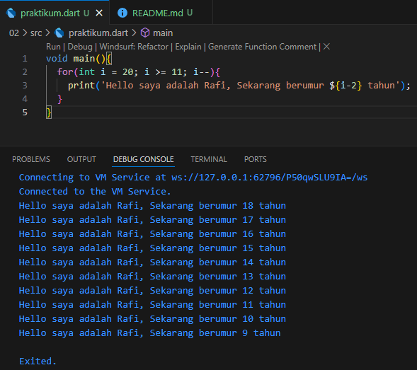

# Soal 1
# Kode program

```dart
void main(){
  for(int i = 20; i >= 11; i--){
    print('Hello saya adalah Rafi, Sekarang berumur ${i-2} tahun');
  }
}
```

# Output


Penjelasan Kode Program

void main() { ... }

Fungsi main() adalah pintu masuk utama atau titik awal dari setiap program Dart. Kode yang berada di dalam kurung kurawal {} inilah yang akan dieksekusi pertama kali saat program dijalankan.

for(int i = 20; i >= 11; i--){ ... }

Ini adalah struktur perulangan for yang dirancang untuk menjalankan blok kode di dalamnya secara berulang dengan aturan tertentu.

Inisialisasi: int i = 20
Sebuah variabel bernama i dibuat dan diberi nilai awal 20. Variabel ini berfungsi sebagai penghitung (counter).

Kondisi: i >= 11
Perulangan akan terus berjalan selama nilai i lebih besar dari atau sama dengan 11. Jika kondisi ini tidak lagi terpenuhi, perulangan akan berhenti.

Iterasi: i--
Setelah setiap perulangan selesai, nilai i akan dikurangi satu (decrement). Ini menyebabkan perulangan berjalan secara mundur.

print(): Fungsi ini digunakan untuk mencetak atau menampilkan teks ke konsol.

${i-2}: Ini adalah interpolasi string. Program akan melakukan operasi matematika i - 2 terlebih dahulu, dan hasilnya akan disisipkan ke dalam kalimat sebelum dicetak.

# Soal 2
Mengapa sangat penting untuk memahami bahasa pemrograman Dart sebelum kita menggunakan framework Flutter ? Jelaskan!

Jawab: Sangat penting untuk memahami bahasa pemrograman Dart sebelum menggunakan Flutter karena Dart adalah fondasi tempat Flutter dibangun. Tanpa pemahaman Dart yang kuat, Anda hanya akan bisa menggunakan komponen Flutter di permukaan tanpa benar-benar bisa membangun logika aplikasi yang kompleks, efisien, dan mudah dirawat.

Analogi sederhananya, Flutter adalah kerangka mobil, sementara Dart adalah mesin, sistem transmisi, dan kelistrikannya. Anda mungkin bisa mengecat dan memodifikasi bodi mobil (UI), tetapi Anda tidak akan bisa memperbaiki mesin, mengoptimalkan konsumsi bahan bakar, atau menambah kecepatan tanpa memahami cara kerja mesin itu sendiri.

# Soal 3
Rangkuman materi dari codelab untuk membantu proses pengembangan aplikasi mobile menggunakan framework Flutter.

