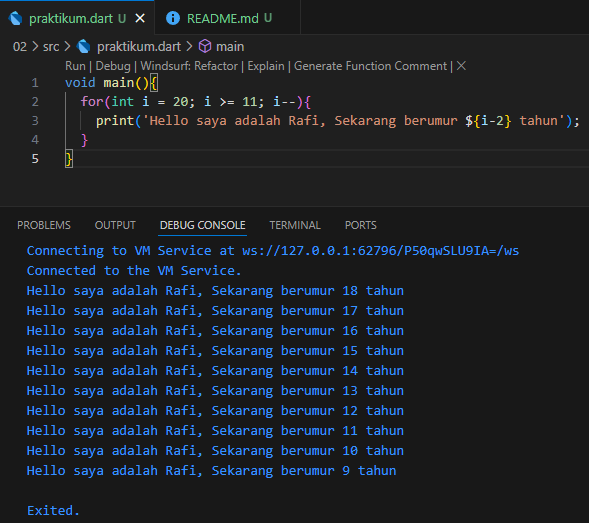

# Soal 1
# Kode program

```dart
void main(){
  for(int i = 20; i >= 11; i--){
    print('Hello saya adalah Rafi, Sekarang berumur ${i-2} tahun');
  }
}
```

# Output


Penjelasan Kode Program

void main() { ... }

Fungsi main() adalah pintu masuk utama atau titik awal dari setiap program Dart. Kode yang berada di dalam kurung kurawal {} inilah yang akan dieksekusi pertama kali saat program dijalankan.

for(int i = 20; i >= 11; i--){ ... }

Ini adalah struktur perulangan for yang dirancang untuk menjalankan blok kode di dalamnya secara berulang dengan aturan tertentu.

Inisialisasi: int i = 20
Sebuah variabel bernama i dibuat dan diberi nilai awal 20. Variabel ini berfungsi sebagai penghitung (counter).

Kondisi: i >= 11
Perulangan akan terus berjalan selama nilai i lebih besar dari atau sama dengan 11. Jika kondisi ini tidak lagi terpenuhi, perulangan akan berhenti.

Iterasi: i--
Setelah setiap perulangan selesai, nilai i akan dikurangi satu (decrement). Ini menyebabkan perulangan berjalan secara mundur.

print(): Fungsi ini digunakan untuk mencetak atau menampilkan teks ke konsol.

${i-2}: Ini adalah interpolasi string. Program akan melakukan operasi matematika i - 2 terlebih dahulu, dan hasilnya akan disisipkan ke dalam kalimat sebelum dicetak.

# Soal 2
Mengapa sangat penting untuk memahami bahasa pemrograman Dart sebelum kita menggunakan framework Flutter ? Jelaskan!

Jawab: Sangat penting untuk memahami bahasa pemrograman Dart sebelum menggunakan Flutter karena Dart adalah fondasi tempat Flutter dibangun. Tanpa pemahaman Dart yang kuat, Anda hanya akan bisa menggunakan komponen Flutter di permukaan tanpa benar-benar bisa membangun logika aplikasi yang kompleks, efisien, dan mudah dirawat.

Analogi sederhananya, Flutter adalah kerangka mobil, sementara Dart adalah mesin, sistem transmisi, dan kelistrikannya. Anda mungkin bisa mengecat dan memodifikasi bodi mobil (UI), tetapi Anda tidak akan bisa memperbaiki mesin, mengoptimalkan konsumsi bahan bakar, atau menambah kecepatan tanpa memahami cara kerja mesin itu sendiri.

# Soal 3
Rangkuman materi dari codelab untuk membantu proses pengembangan aplikasi mobile menggunakan framework Flutter.

Asal-usul dan Kebangkitan
- Diciptakan oleh Google pada tahun 2011 sebagai alternatif JavaScript, namun awalnya kurang diterima.
- Popularitasnya meroket setelah menjadi bahasa utama untuk framework Flutter.

Fitur Teknis Utama
- Multi-Platform: Dapat dikompilasi menjadi kode mesin (seluler), JavaScript (web), dan executable (desktop).
- Kompilasi JIT & AOT: Menggunakan kompilasi JIT (Just-In-Time) saat pengembangan untuk fitur hot reload, dan AOT (Ahead-Of-Time) untuk performa cepat saat rilis.
- Isolates: Menjalankan kode dalam isolate untuk menangani tugas asynchronous secara efisien tanpa memblokir thread utama, dan mendukung paralelisasi.
- Type Safety & Null Safety: Memastikan variabel memiliki tipe data yang sesuai dan mencegah error akibat nilai null, membuat kode lebih stabil dan andal.

Sintaks dan Paradigma
- Sintaksnya merupakan perpaduan antara Java dan JavaScript, sehingga terasa familier.
- Setiap program dimulai dengan fungsi main().
- Mendukung type inference (menggunakan var) dan deklarasi tipe eksplisit.
- Berorientasi objek, di mana hampir semua hal adalah objek dari sebuah kelas.
- Mendukung pemrograman fungsional dan pewarisan berbasis mixin.

Ekosistem
- Memiliki manajer paket bernama Pub yang menyediakan akses ke ribuan library dan paket open-source untuk memperluas fungsionalitas aplikasi.

# Soal 4
Penjelasan dan contoh eksekusi kode tentang perbedaan Null Safety dan Late variabel !

Null Safety adalah aturan dasar dalam Dart yang mencegah variabel memiliki nilai null secara default untuk menghindari error. Sementara itu, late adalah sebuah kata kunci khusus yang Anda gunakan untuk membuat "janji" kepada Dart bahwa Anda akan mengisi nilai pada sebuah variabel non-nullable nanti, tetapi pasti sebelum variabel itu digunakan.
- Null Safety
Null Safety adalah sebuah fitur besar di Dart yang mengubah cara kerja variabel. Aturan utamanya adalah: sebuah variabel tidak boleh berisi null kecuali Anda secara eksplisit mengizinkannya.

Tujuannya adalah untuk menghilangkan error yang sangat umum terjadi di banyak bahasa pemrograman, yaitu mencoba mengakses sesuatu pada variabel yang ternyata nilainya null (sering disebut null pointer exception).

Bagaimana cara kerjanya?

Non-nullable by Default: Setiap variabel yang Anda deklarasikan harus segera diberi nilai.
Mengizinkan Null dengan ?: Jika Anda ingin sebuah variabel boleh bernilai null, Anda harus menambahkah tanda tanya (?) setelah tipe datanya.

Contoh Eksekusi Kode (Null Safety)

```dart
void main() {
  // 1. ERROR: Variabel non-nullable 'name' harus diinisialisasi.
  // String name;
  // print(name);

  // 2. SOLUSI A: Langsung beri nilai (inisialisasi)
  String name = 'Budi';
  print('Nama: $name');

  // 3. SOLUSI B: Izinkan variabel menjadi null dengan '?'
  String? address;
  print('Alamat: $address');

  // Mengisi nilai pada variabel nullable
  address = 'Jakarta';
  print('Alamat baru: $address');
}
```
Hasil Kode di atas


Variabel late

Kata kunci late digunakan pada variabel yang non-nullable (tidak boleh null), tetapi nilainya baru akan diberikan nanti (lazy initialization).

Kapan ini berguna?
- Ketika nilai variabel bergantung pada proses lain yang perlu dijalankan terlebih dahulu (misalnya, mengambil data dari internet).
- Untuk variabel yang proses pembuatannya memakan banyak sumber daya dan Anda hanya ingin membuatnya saat benar-benar dibutuhkan.

Contoh Eksekusi Kode (late)
```dart
class Story {
  // Kita berjanji 'description' akan diisi sebelum diakses.
  late String description;

  // Sebuah method untuk mengambil dan mengisi data.
  void fetchDescription() {
    print('Mengambil deskripsi...');
    description = 'Ini adalah cerita petualangan yang seru!';
  }
}

void main() {
  var myStory = Story();

  // Memanggil method untuk memenuhi janji
  myStory.fetchDescription();

  // Sekarang aman untuk mengakses 'description' karena sudah diisi
  print(myStory.description);
}
```
Hasil Kode di atas

