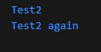

## Praktikum 1

Langkah 1:
```dart
void main(){
    String test = "test2";
    if (test == "test1") {
      print("Test1");
    } else if (test == "test2") {
      print("Test2");
    } else {
      print("Something else");
    }
    if (test == "test2") print("Test2 again");
}
```
Langkah 2:
Output kode program pada langkah 1



Langkah 3:

Menambahkan kode program berikut
```dart
String test = "true";
if (test) {
   print("Kebenaran");
}
```
Setelah menambahkan kode program tersebut kode program terjadi error


Perbaikan kode program tersebut karena error
```dart
void main(){
    String test = "test2";
    if (test == "test1") {
      print("Test1");
    } else if (test == "test2") {
      print("Test2");
    } else {
      print("Something else");
    }
    if (test == "test2") print("Test2 again");
    String test2 = "true";
    if (test2 == "true") {
      print("Kebenaran");
    }
}
```
Dengan membuat variabel baru kemudian menambahkan == "true", dan outputnya sebagai berikut:


## Praktikum 2

Langkah 1:
```dart
void main() {
  int counter = 0;
  while (counter < 33) {
    print(counter);
    counter++;
  }
}
```
Langkah 2:
Output kode program tersebut


Output perulangan dari variabel counter sebanyak 32

Langkah 3:
Menambahkan kode berikut
```dart
do {
  print(counter);
  counter++;
} while (counter < 77);
```


Outputnya adalah yang awalnya perulangan terjadi sampai < 33 saat ditambahkan kode program tersebut jadi lanjut sampai < 77

## Praktikum 3
Langkah 1:

Menambahkan kode berikut pada main()
```dart
void main() {
  for (int index = 10; index < 27; index++) {
    print(index);
  }
}
```
Langkah 2:
Output kode program pada langkah 1


Output berupa perulangan index dari 10 sampai 26

Langkah 3:


Output kosong, karena setiap kali index >= 10, kondisi index > 1 selalu benar → selalu continue.

## Tugas Praktikum
Buatlah sebuah program yang dapat menampilkan bilangan prima dari angka 0 sampai 201 menggunakan Dart. Ketika bilangan prima ditemukan, maka tampilkan nama lengkap dan NIM Anda.
```dart
void main() {
  String nim = "2341720158";
  String nama = "Muhammad Rafi Rajendra";

  for (int n = 0; n <= 203; n++) {
    bool prima = true;

    if (n < 2) {
      prima = false;
    } else {
      for (int i = 2; i * i <= n; i++) {
        if (n % i == 0) {
          prima = false;
          break;
        }
      }
    }

    if (prima) {
      print("$n $nama ($nim)");
    } else {
      print("$n");
    }
  }
}
```
Output kode program pada tugas praktikum

