# Praktikum Pemrograman Mobile
**Nama**  : Muhammad Rafi Rajendra  
**NIM**   : 2341720158  
**Kelas** : TI-3H  

## Praktikum 1:  Eksperimen Tipe Data List

Langkah 1:
```dart
var list = [1, 2, 3];
assert(list.length == 3);
assert(list[1] == 2);
print(list.length);
print(list[1]);

list[1] = 1;
assert(list[1] == 1);
print(list[1]);
```

Langkah 2:

Running code dari langkah 1

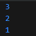

Langkah 3:
Ubah kode pada langkah 1 menjadi variabel final yang mempunyai index = 5 dengan default value = null. Isilah nama dan NIM Anda pada elemen index ke-1 dan ke-2

```dart
  final list = List<dynamic>.filled(5, null);
  list[1] = 'Rafi Rajendra';
  list[2] = '2341720158';

  print(list.length);
  print(list[1]);
  print(list[2]);
```
Hasil running kode di atas

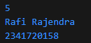

## Praktikum 2: Eksperimen Tipe Data Set

Langkah 1:
```dart
void main(){
  var halogens = {'fluorine', 'chlorine', 'bromine', 'iodine', 'astatine'};
  print(halogens);

}
```
Langkah 2:

Hasil run kode di atas

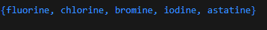

Langkah 3:

Tambahkan kode program berikut, lalu coba eksekusi (Run) kode Anda.

```dart
var names1 = <String>{};
Set<String> names2 = {}; // This works, too.
var names3 = {}; // Creates a map, not a set.

print(names1);
print(names2);
print(names3);
```
Output ketika sudah menambahkan kode program tersebut

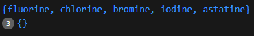

Karena kosong kemudian saya tambah kan kode berikut
```dart
  names1.add('Muhammad Rafi Rajendra');
  names1.add('2341720158');
  names2.addAll(['Muhammad Rafi Rajendra', '2341720158']);
```
Output setelah menambahkan kode program tersebut

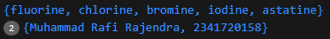

## Praktikum 3: Eksperimen Tipe Data Maps
Langkah 1:
```dart
var gifts = {
  // Key:    Value
  'first': 'partridge',
  'second': 'turtledoves',
  'fifth': 1
};

var nobleGases = {
  2: 'helium',
  10: 'neon',
  18: 2,
};

print(gifts);
print(nobleGases);
```

Langkah 2:

Output kode program pada langkah 1

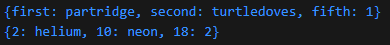

Langkah 3:

Menambahkan kode program berikut
```dart
var mhs1 = Map<String, String>();
gifts['first'] = 'partridge';
gifts['second'] = 'turtledoves';
gifts['fifth'] = 'golden rings';

var mhs2 = Map<int, String>();
nobleGases[2] = 'helium';
nobleGases[10] = 'neon';
nobleGases[18] = 'argon';
```
Hasilnya kode program tidak error tetapi variable mhs1 dan mhs2 tidak digunakan jadi output sama seperti sebelum ditambahkan kode program tersebut


Kode program saya lakukan perubahan sebagai berikut:
```dart
  var gifts = {
    'first': 'partridge',
    'second': 'turtledoves',
    'fifth': 1
  };

  var nobleGases = {
    2: 'helium',
    10: 'neon',
    18: 2,
  };

  gifts['nama'] = 'Rafi Rajendra'; 
  gifts['nim'] = '2341720158';   

  nobleGases[99] = 'Rafi Rajendra'; 
  nobleGases[100] = '2341720158'; 

  print(gifts);
  print(nobleGases);

  var mhs1 = Map<String, String>();
  mhs1['nama'] = 'Rafi Rajendra'; 
  mhs1['nim'] = '2341720158';   

  var mhs2 = Map<int, String>();
  mhs2[99] = 'Rafi Rajendra'; 
  mhs2[100] = '2341720158'; 
```
Hasil dari kode program di atas

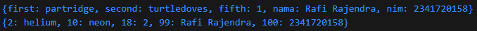

## Praktikum 4: Eksperimen Tipe Data List: Spread dan Control-flow Operators

Langkah 1:
Ketik atau salin kode program berikut ke dalam fungsi main().
```dart
void main(){
  var list = [1, 2, 3];
  var list2 = [0, ...list];
  print(list);
  print(list2);
  print(list2.length);
}
```
Langkah 2:

Hasil kode program pada langkah 1

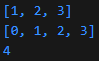

Langkah 3:

Tambahkan kode program berikut, lalu coba eksekusi (Run) kode Anda.
```dart
list1 = [1, 2, null];
print(list1);
var list3 = [0, ...?list1];
print(list3.length);
```

Kode program error berikut perbaikannya
```dart
void main() {
  var list = [1, 2, 3];
  var list2 = [0, ...list];
  print(list);
  print(list2);
  print(list2.length);

  var nimList = [2, 3, 4, 1, 7, 2, 0, 1, 5, 8];
  var nimList2 = [...nimList];
  print(nimList2);
}
```
Output kode program pada langkah 3

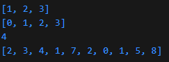

Langkah 4:

Tambahkan kode program berikut, lalu coba eksekusi (Run) kode Anda.
```dart
var nav = ['Home', 'Furniture', 'Plants', if (promoActive) 'Outlet'];
print(nav);
```
Kode program tersebut error karena promoActive undefinedName. Berikut perbaikannya
```dart
  var promoActive = false;
  var nav = ['Home', 'Furniture', 'Plants', if (promoActive) 'Outlet'];
  print(nav);
```

Kondisi ketika promoActive = true

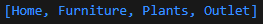

Kondisi ketika promoActive = false

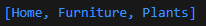

Langkah 5:

Tambahkan kode program berikut, lalu coba eksekusi (Run) kode Anda.
```dart
var nav2 = ['Home', 'Furniture', 'Plants', if (login case 'Manager') 'Inventory'];
print(nav2);
```
Perbaikan kode program di atas dan menambahkan variabel login dengan kondisi lain
```dart
  var login = 'Manager';
  var nav2 = ['Home', 'Furniture', 'Plants', if (login case 'Manager') 'Inventory'];
  print('Login : $login + ${nav2}');

  login = 'Admin';
  var nav3 = ['Home', 'Furniture', 'Plants', if (login case 'Admin') 'Orders'];
  print('Login : $login + ${nav3}');

  login = 'User';
  var nav4 = ['Home', 'Furniture', 'Plants', if (login case 'User') 'Profile'];
  print('Login : $login + ${nav4}');
```
Hasil kode program pada langkah 5

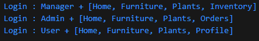

Langkah 6:

Tambahkan kode program berikut, lalu coba eksekusi (Run) kode Anda.
```dart
var listOfInts = [1, 2, 3];
var listOfStrings = ['#0', for (var i in listOfInts) '#$i'];
assert(listOfStrings[1] == '#1');
print(listOfStrings);
```
Kode tidak error dan ini hasilnya

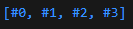

Manfaat dari Collection for:
- Memudahkan pembuatan list secara dinamis dari koleksi lain.
- Membuat kode lebih singkat, rapi, dan mudah dibaca.
- Mengurangi kebutuhan penggunaan loop terpisah untuk membangun list baru.

## Praktikum 5: Eksperimen Tipe Data Records
Langkah 1:

Ketik atau salin kode program berikut ke dalam fungsi main().
```dart
var record = ('first', a: 2, b: true, 'last');
print(record)
```

Langkah 2:

Hasil run kode pada langkah 1

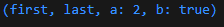

Langkah 3:

Tambahkan kode program berikut di luar scope void main(), lalu coba eksekusi (Run) kode Anda.
```dart
(int, int) tukar((int, int) record) {
  var (a, b) = record;
  return (b, a);
}
```
Gunakan fungsi tukar() di dalam main() sehingga tampak jelas proses pertukaran value field di dalam Records.
```dart
void main() {
  var record = ('first', a: 2, b: true, 'last');
  print("Record awal: $record");

  (int, int) angka = (10, 20);
  print("Sebelum tukar: $angka");

  var hasil = tukar(angka);
  print("Sesudah tukar: $hasil");
}

(int, int) tukar((int, int) record) {
  var (a, b) = record;
  return (b, a);
}

```
Hasil kode program pada langkah 3

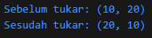

Langkah 4:
Tambahkan kode program berikut di dalam scope void main(), lalu coba eksekusi (Run) kode Anda.
```dart
// Record type annotation in a variable declaration:
(String, int) mahasiswa;
print(mahasiswa);
```
Inisialisasi field nama dan NIM Anda pada variabel record mahasiswa di atas.
```dart
  (String, int) mahasiswa = ('Rafi Rajendra', 2341720158);
  print("Data Mahasiswa: $mahasiswa");
```
Berikut hasil dari kode pada langkah 4

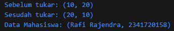

Langkah 5:

Tambahkan kode program berikut di dalam scope void main(), lalu coba eksekusi (Run) kode Anda.
```dart
var mahasiswa2 = ('first', a: 2, b: true, 'last');

print(mahasiswa2.$1);
print(mahasiswa2.a); 
print(mahasiswa2.b); 
print(mahasiswa2.$2);
```

Gantilah salah satu isi record dengan nama dan NIM Anda
```dart
  var mahasiswa2 = ('Rafi Rajendra', a: 2341720158, b: true, 'last');

  print(mahasiswa2.$1); // Prints 'first'
  print(mahasiswa2.a); // Prints 2
  print(mahasiswa2.b); // Prints true
  print(mahasiswa2.$2); // Prints 'last'
```
Hasil kode program pada langkah 5

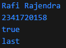

## Tugas Praktikum
1. Silakan selesaikan Praktikum 1 sampai 5, lalu dokumentasikan berupa screenshot hasil pekerjaan Anda beserta penjelasannya!
2. Jelaskan yang dimaksud Functions dalam bahasa Dart!
3. Jelaskan jenis-jenis parameter di Functions beserta contoh sintaksnya!
4. Jelaskan maksud Functions sebagai first-class objects beserta contoh sintaknya!
5. Apa itu Anonymous Functions? Jelaskan dan berikan contohnya!
6. Jelaskan perbedaan Lexical scope dan Lexical closures! Berikan contohnya!
7. Jelaskan dengan contoh cara membuat return multiple value di Functions!

### Jawab Tugas Praktikum
2. Functions adalah blok kode yang dapat dipanggil untuk menjalankan tugas tertentu. Functions membantu memecah program menjadi bagian-bagian kecil yang mudah dikelola dan digunakan kembali.
3. Positional parameter: Parameter yang urutannya harus sesuai saat pemanggilan., Optional positional parameter: Parameter yang boleh tidak diisi, biasanya menggunakan tanda []., Named parameter: Parameter yang dipanggil dengan nama, biasanya menggunakan {}.
4. Functions sebagai first-class objects berarti function dapat disimpan dalam variabel, dikirim sebagai parameter, dan dikembalikan dari function lain.
5. Anonymous Functions adalah function tanpa nama, biasanya digunakan sebagai parameter atau callback.
6. Lexical scope: Penentuan variabel berdasarkan posisi kode saat penulisan. Sedangkan, Lexical closure: Function yang "mengikat" variabel dari scope luar meski scope luar sudah selesai.
7. Gunakan record atau tuple:
```dart
(String, int) getData() {
  return ('Rafi Rajendra', 2341720158);
}
var data = getData();
print(data.$1); // 'Rafi Rajendra'
print(data.$2); // 2341720158
```