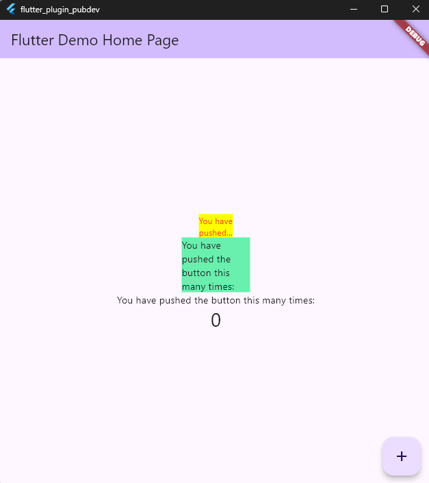

# Praktikum Pemrograman Mobile

**Nama**  : Muhammad Rafi Rajendra  
**NIM**   : 2341720158  
**Kelas** : TI-3H

# Praktikum Menerapkan Plugin di Project Flutter
Hasil dari praktikum menerapkan plugin di Project Flutter

## Jelaskan maksud dari langkah 2 pada praktikum tersebut!
Langkah 2 (menjalankan flutter pub add auto_size_text) adalah tindakan resmi untuk menambahkan dependensi pihak ketiga ke proyek Flutter Anda: menambahkan entri ke pubspec.yaml, mengunduh paket, dan membuatnya siap dipakai. Setelah itu tinggal melakukan import dan menggunakan AutoSizeText untuk membuat teks yang otomatis menyesuaikan ukurannya agar muat pada ruang yang tersedia.

## Jelaskan maksud dari langkah 5 pada praktikum tersebut!
Langkah 5 membuat widget RedTextWidget menjadi lebih aman dan jelas dipakai: properti text dideklarasikan immutable (final) dan konstruktor memaksa pemanggil memberikan teks (required this.text) sambil memungkinkan optimisasi dengan const serta meneruskan key ke parent untuk mekanisme identifikasi widget.

## Pada langkah 6 terdapat dua widget yang ditambahkan, jelaskan fungsi dan perbedaannya!
RedTextWidget (AutoSizeText) adalah versi adaptif yang mengecilkan font agar teks tetap muat dan rapi (dengan elipsis), sedangkan Text default tidak mengecilkan dan hanya membungkus/potong tergantung constraints.

## Jelaskan maksud dari tiap parameter yang ada di dalam plugin auto_size_text berdasarkan tautan pada dokumentasi https://pub.dev/documentation/auto_size_text/latest/
Penjelasan parameter AutoSizeText (ringkasan dari dokumentasi pub.dev)
Berikut penjelasan tiap parameter penting pada AutoSizeText beserta default dan catatan praktis. Saya fokus pada konstruktor utama (AutoSizeText(...)) dan hal terkait (rich text, group, troubleshooting).
- text (positional / data)
    - Isi/teks yang akan ditampilkan. Sama seperti pada Text.
- key

    - Key untuk widget; perilaku sama seperti Text/Widget pada umumnya, membantu identifikasi di widget tree.
- textKey

    - Key spesifik yang diteruskan ke widget Text yang dihasilkan oleh AutoSizeText. Berguna untuk testing atau identifikasi internal teks.
- style

    - TextStyle yang menjadi basis ukuran font awal (mis. fontSize: 20). AutoSizeText mulai dari ukuran ini lalu men-scale turun jika perlu. Jika tidak disediakan, akan mewarisi style dari konteks (Theme).
- minFontSize

    - Ukuran font minimum yang diizinkan saat auto-scaling. Default: 12. Jika teks masih tidak muat setelah mencapai minFontSize, perilaku selanjutnya tergantung overflow atau overflowReplacement.
Contoh: minFontSize: 10.
- maxFontSize

    - Batas atas untuk font size yang bisa dihasilkan (berguna saat style diwariskan dan Anda ingin membatasi ukuran paling besar). Jika tidak di-set, nilai awalnya dari style.fontSize.
- stepGranularity

    - Seberapa banyak font-size dikurangi setiap langkah saat mencoba mengecilkan teks. Nilai tipikal >= 1 untuk performa bagus. Bisa di-set ke decimal (mis. 0.1) jika butuh presisi.
Contoh: stepGranularity: 1 (default kira-kira), atau 0.1 untuk perubahan halus.
- presetFontSizes

    - Daftar ukuran font yang diizinkan (harus dalam urutan menurun). Jika diset, minFontSize, maxFontSize, dan stepGranularity diabaikan.
Contoh: presetFontSizes: [40, 20, 14] → hanya akan memilih salah satu nilai ini.
- group (AutoSizeGroup)

    - Mengelompokkan beberapa AutoSizeText agar mereka memiliki ukuran font yang sama (padanan ukuran terkecil yang diperlukan oleh anggota grup). Berguna untuk menjaga konsistensi tipe di baris/kolom. Simpan instance AutoSizeGroup di State (jangan buat baru tiap build).
Catatan: jika salah satu member tidak bisa mengecil karena minFontSize, grup tidak akan menyamakannya.
- textAlign

    - Perilaku alignment horizontal teks — sama seperti parameter Text.
- textDirection

    - Menentukan arah teks (LTR/RTL) — sama seperti Text.
- locale

    - Locale untuk pemilihan font/glyphs saat karakter bisa dirender berbeda di locale berbeda.
- softWrap

    - Sama seperti Text — apakah teks boleh break di soft line breaks.
- wrapWords

    - Jika false, kata yang terlalu panjang tidak akan dibungkus (break) di tengah. Default true — supaya berperilaku sama dengan Text.
- overflow

    - Cara menangani overflow visual (mis. TextOverflow.ellipsis, clip, dsb.). Sama seperti di Text.
- overflowReplacement

    - Widget pengganti yang ditampilkan bila teks tidak muat dan telah mencapai batas pengecilan (mis. terlalu kecil atau masih overflow). Berguna untuk mengganti teks menjadi pesan atau ikon agar tidak jadi teks terlalu kecil.
Contoh: AutoSizeText(..., overflowReplacement: Text('Too long'));
- textScaleFactor

    - Skala teks (seperti di Text) — juga mempengaruhi perhitungan minFontSize, maxFontSize, dan presetFontSizes.
- maxLines

    - Batas jumlah baris (sama seperti Text). Jika tidak di-set, AutoSizeText akan menyesuaikan teks sesuai area yang tersedia.
- semanticsLabel

    - Label yang dipakai untuk accessibility (screen readers), sama seperti Text.
- others flagged as "same as Text"

    - Banyak parameter (locale, semanticsLabel, textAlign, textDirection, softWrap, overflow, dsb.) berperilaku identik dengan Text.
