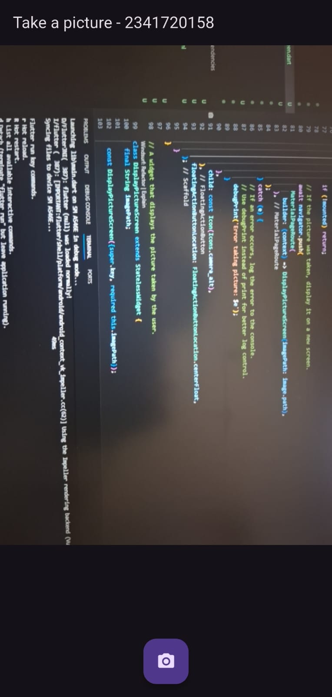
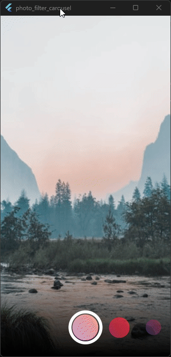

# Praktikum Pemrograman Mobile

**Nama**  : Muhammad Rafi Rajendra  
**NIM**   : 2341720158  
**Kelas** : TI-3H

## Praktikum 1

### Tujuan Praktikum
Membuat aplikasi Flutter yang dapat mengambil gambar dari kamera dan menampilkannya di layar.

### Langkah-Langkah Praktikum

1. **Membuat Project Flutter Baru**
   - Membuat project baru dengan nama `kamera_flutter` menggunakan perintah:
     ```
     flutter create kamera_flutter
     cd kamera_flutter
     ```

2. **Menambahkan Dependency**
   - Menambahkan plugin kamera, path_provider, dan path:
     ```
     flutter pub add camera path_provider path
     ```

3. **Pengaturan Permissions**
   - Menambah permission pada Info.plist (iOS) untuk akses kamera dan mikrofon.

4. **Inisialisasi Kamera**
   - Inisialisasi kamera pada fungsi `main()` secara async untuk mendapatkan kamera yang tersedia.

5. **Membuat Widget untuk Mengambil dan Menampilkan Foto**
   - Membuat widget `TakePictureScreen` untuk mengambil foto.
   - Membuat widget `DisplayPictureScreen` untuk menampilkan foto hasil pengambilan gambar.

6. **Implementasi FloatingActionButton**
   - FloatingActionButton berfungsi untuk mengambil gambar saat ditekan.

7. **Menampilkan Hasil Foto**
   - Setelah foto diambil, hasilnya ditampilkan pada layar baru menggunakan `Navigator` dan widget `Image.file`.

### Output Praktikum

Berikut tampilan output hasil praktikum ketika aplikasi dijalankan dan berhasil mengambil serta menampilkan gambar dari kamera:



## Praktikum 2

### Tujuan Praktikum
Membuat aplikasi Flutter yang memungkinkan pengguna memilih filter warna pada foto, serta mengimplementasikan carousel filter interaktif menggunakan widget custom.

### Langkah-Langkah Praktikum

1. **Membuat Project Flutter Baru**
   - Membuat project baru dengan nama `photo_filter_carousel`.

2. **Membuat Folder dan File Widget**
   - Membuat folder `widget` untuk menampung file-file custom widget yang akan digunakan.

3. **Implementasi Widget FilterSelector**
   - Membuat file `lib/widget/filter_selector.dart`.
   - Widget ini menampilkan carousel filter warna yang bisa digeser (filter selector), dilengkapi efek shadow gradient dan selection ring.

4. **Membuat Widget PhotoFilterCarousel**
   - Membuat file `lib/widget/filter_carousel.dart`.
   - Widget utama untuk menampilkan foto dengan filter warna yang dapat diganti-ganti.
   - Menggunakan `ValueNotifier` dan `ValueListenableBuilder` untuk menerapkan filter warna secara reaktif.

5. **Membuat Flow Delegate Untuk Carousel**
   - Membuat file `lib/widget/carousel_flowdelegate.dart`.
   - Kode ini mengatur transformasi dan transisi visual filter saat digeser menggunakan animasi scale, opacity, dan posisi.

6. **Widget FilterItem**
   - Membuat file `lib/widget/filter_item.dart`.
   - Widget untuk menampilkan satu elemen filter (berupa bulat dengan texture dan color overlay).

7. **Integrasi Semua Widget di Main**
   - Mengimpor dan menjalankan `PhotoFilterCarousel` pada file `lib/main.dart`.

### Output Praktikum

Berikut tampilan output praktikum ketika carousel filter berhasil diimplementasikan dan diujicobakan pada aplikasi:



### Penjelasan dan Uji Kode
- Carousel filter menampilkan beberapa warna yang bisa dipilih untuk mengubah tampilan foto utama.
- Efek scale dan opacity pada filter-item memberikan efek 3D carousel yang menarik.
- Widget selection ring dan gradient bawah memperjelas filter yang sedang dipilih.

## Tugas Praktikum
1. Selesaikan Praktikum 1 dan 2, lalu dokumentasikan dan push ke repository Anda berupa screenshot setiap hasil pekerjaan beserta penjelasannya di file README.md! Jika terdapat error atau kode yang tidak dapat berjalan, silakan Anda perbaiki sesuai tujuan aplikasi dibuat!
2. Gabungkan hasil praktikum 1 dengan hasil praktikum 2 sehingga setelah melakukan pengambilan foto, dapat dibuat filter carouselnya!
- Sudah saya gabung pada file kamera_flutter jadi setelah mengambil foto bisa langsung menggunakanfilter carouselnya. Berikut hasilnya


3. Jelaskan maksud void async pada praktikum 1?
   #### Penjelasan Maksud `void async` pada Praktikum 1

   Pada Praktikum 1, fungsi `main()` dibuat menjadi `async` seperti berikut:
   - **`async`** berarti fungsi tersebut mendukung operasi asinkron menggunakan keyword `await`.
   - Fungsi ini menjadi non-blocking sehingga proses yang membutuhkan waktu (seperti mengambil daftar kamera device) dapat dijalankan sambil menunggu hasilnya tanpa membekukan seluruh aplikasi.
   #### Mengapa Perlu?
   - Karena `availableCameras()` adalah fungsi asinkron yang hasilnya baru siap setelah beberapa waktu. Supaya bisa memakai `await availableCameras()`, fungsi `main()` harus diberi modifier `async`.
   - Dengan pendekatan ini, aplikasi hanya akan benar-benar dijalankan setelah resource penting (daftar kamera device) selesai dipersiapkan.
   #### Kesimpulan:
   - **`async`** pada fungsi `main()` memungkinkan pemakaian `await` di dalamnya, yang sangat berguna untuk menyiapkan hal-hal penting secara asinkron sebelum menjalankan UI aplikasi Flutter.

4. Jelaskan fungsi dari anotasi @immutable dan @override ?
   #### a. Fungsi `@immutable`

   - **Pengertian:**  
   Anotasi `@immutable` digunakan pada sebuah class (biasanya widget) untuk menandakan bahwa semua field dalam class tersebut tidak boleh diubah (immutable) setelah objek dibuat.

   - **Tujuan:**  
   Membantu mengindikasikan pada Dart analyzer bahwa class tersebut hanya boleh berisi field `final` (constant). Jika field diubah setelah objek dibuat, akan ada warning/error pada waktu compile.
   
   #### b. Fungsi `@override`

   - **Pengertian:**  
   Anotasi `@override` digunakan ketika ingin menulis ulang (meng-override) method yang sudah ada di superclass (misal: mengganti fungsi `build()` dari `StatelessWidget`).

   - **Tujuan:**  
   Supaya kode lebih jelas (eksplisit) bahwa method tersebut merupakan hasil override dari induknya, sekaligus membantu Dart analyzer menemukan kesalahan penulisan signature/method.

5. Kumpulkan link commit repository GitHub Anda kepada dosen yang telah disepakati!
