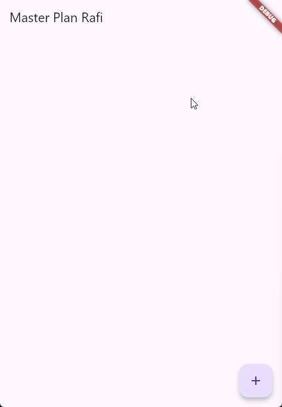
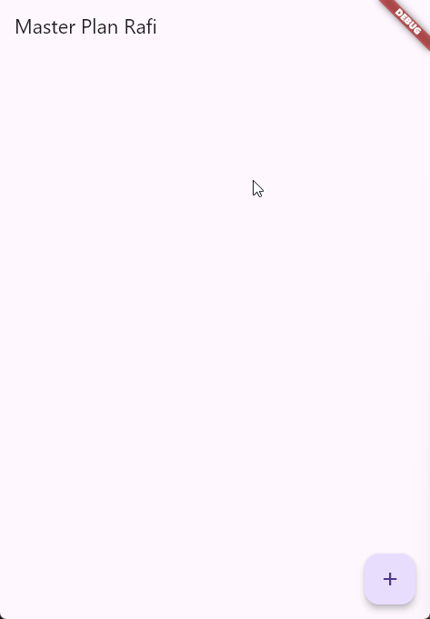
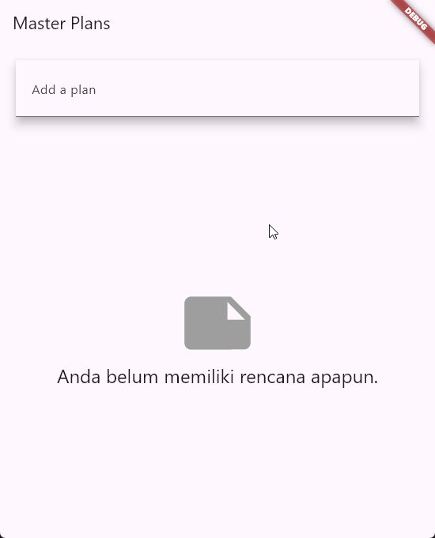

# Praktikum Pemrograman Mobile

**Nama**  : Muhammad Rafi Rajendra  
**NIM**   : 2341720158  
**Kelas** : TI-3H

## Praktikum 1: Dasar State dengan Model-View

### Langkah 1: Buat Project Baru
Membuat project Flutter baru dengan nama `master_plan` dengan struktur folder:
```
master_plan/
├── lib/
│   ├── models/
│   │   ├── data_layer.dart
│   │   ├── plan.dart
│   │   └── task.dart
│   ├── views/
│   │   └── plan_screen.dart
│   └── main.dart
```

### Langkah 2: Membuat model task.dart
Membuat class `Task` untuk menyimpan data tugas dengan atribut `description` dan `complete`.

**File: lib/models/task.dart**
```dart
class Task {
  final String description;
  final bool complete;
  
  const Task({
    this.complete = false,
    this.description = '',
  });
}
```

### Langkah 3: Buat file plan.dart
Membuat class `Plan` untuk menyimpan daftar tugas.

**File: lib/models/plan.dart**
```dart
import './task.dart';

class Plan {
  final String name;
  final List<Task> tasks;
  
  const Plan({this.name = '', this.tasks = const []});
}
```

### Langkah 4: Buat file data_layer.dart
Membuat file untuk mengekspor model secara ringkas.

**File: lib/models/data_layer.dart**
```dart
export 'plan.dart';
export 'task.dart';
```

### Langkah 5: Pindah ke file main.dart
Mengubah file main.dart untuk menjalankan aplikasi Master Plan.

**File: lib/main.dart**
```dart
import 'package:flutter/material.dart';
import './views/plan_screen.dart';

void main() => runApp(MasterPlanApp());

class MasterPlanApp extends StatelessWidget {
  const MasterPlanApp({super.key});

  @override
  Widget build(BuildContext context) {
    return MaterialApp(
     theme: ThemeData(primarySwatch: Colors.purple),
     home: PlanScreen(),
    );
  }
}
```

### Langkah 6: Buat plan_screen.dart
Membuat halaman utama aplikasi dengan StatefulWidget.

**File: lib/views/plan_screen.dart**
```dart
import '../models/data_layer.dart';
import 'package:flutter/material.dart';

class PlanScreen extends StatefulWidget {
  const PlanScreen({super.key});

  @override
  State createState() => _PlanScreenState();
}

class _PlanScreenState extends State<PlanScreen> {
  Plan plan = const Plan();

  @override
  Widget build(BuildContext context) {
   return Scaffold(
    appBar: AppBar(title: const Text('Master Plan Rafi')),
    body: _buildList(),
    floatingActionButton: _buildAddTaskButton(),
   );
  }
}
```

### Langkah 7: Buat method _buildAddTaskButton()
Menambahkan tombol floating action button untuk menambah tugas baru.

```dart
Widget _buildAddTaskButton() {
  return FloatingActionButton(
   child: const Icon(Icons.add),
   onPressed: () {
     setState(() {
      plan = Plan(
       name: plan.name,
       tasks: List<Task>.from(plan.tasks)
       ..add(const Task()),
     );
    });
   },
  );
}
```

### Langkah 8: Buat widget _buildList()
Membuat ListView.builder untuk menampilkan daftar tugas.

```dart
Widget _buildList() {
  return ListView.builder(
   itemCount: plan.tasks.length,
   itemBuilder: (context, index) =>
   _buildTaskTile(plan.tasks[index], index),
  );
}
```

### Langkah 9: Buat widget _buildTaskTile()
Membuat widget ListTile untuk setiap item tugas dengan Checkbox dan TextFormField.

```dart
Widget _buildTaskTile(Task task, int index) {
  return ListTile(
    leading: Checkbox(
        value: task.complete,
        onChanged: (selected) {
          setState(() {
            plan = Plan(
              name: plan.name,
              tasks: List<Task>.from(plan.tasks)
                ..[index] = Task(
                  description: task.description,
                  complete: selected ?? false,
                ),
            );
          });
        }),
    title: TextFormField(
      initialValue: task.description,
      onChanged: (text) {
        setState(() {
          plan = Plan(
            name: plan.name,
            tasks: List<Task>.from(plan.tasks)
              ..[index] = Task(
                description: text,
                complete: task.complete,
              ),
          );
        });
      },
    ),
  );
}
```

### Langkah 10-13: Tambah Scroll Controller
Menambahkan ScrollController untuk mengatasi masalah keyboard di iOS.

**Tambahan di class _PlanScreenState:**
```dart
late ScrollController scrollController;

@override
void initState() {
  super.initState();
  scrollController = ScrollController()
    ..addListener(() {
      FocusScope.of(context).requestFocus(FocusNode());
    });
}

@override
void dispose() {
  scrollController.dispose();
  super.dispose();
}
```

**Update method _buildList():**
```dart
Widget _buildList() {
  return ListView.builder(
    controller: scrollController,
    keyboardDismissBehavior: Theme.of(context).platform == TargetPlatform.iOS
        ? ScrollViewKeyboardDismissBehavior.onDrag
        : ScrollViewKeyboardDismissBehavior.manual,
    itemCount: plan.tasks.length,
    itemBuilder: (context, index) => _buildTaskTile(plan.tasks[index], index),
  );
}
```

### Langkah 14: Hasil



**Penjelasan:**
- Aplikasi Master Plan berhasil dibuat dengan fitur menambah, mengedit, dan menandai tugas sebagai selesai
- Menggunakan state management sederhana dengan StatefulWidget
- Implementasi Model-View pattern dengan memisahkan data layer (models) dan presentation layer (views)
- ScrollController mengatasi masalah keyboard yang menutupi TextField

## Tugas Praktikum 1: Dasar State dengan Model-View

### 1. Dokumentasi GIF dan Penjelasan
**GIF Hasil Akhir:**


**Penjelasan:**
Aplikasi Master Plan telah berhasil dibuat dan berjalan dengan baik. Fitur-fitur yang berhasil diimplementasikan:
- Menambah tugas baru dengan tombol FloatingActionButton (+)
- Mengedit deskripsi tugas melalui TextFormField
- Menandai tugas sebagai selesai dengan Checkbox
- Scroll otomatis dismiss keyboard saat drag
- State management menggunakan setState untuk update UI

### 2. Maksud Langkah 4 - File data_layer.dart
**Jawaban:**

File `data_layer.dart` berfungsi sebagai **barrel file** atau **index file** yang mengekspor semua model dalam satu tempat.

```dart
export 'plan.dart';
export 'task.dart';
```

**Alasan dilakukan:**
- **Simplifikasi Import**: Daripada mengimpor setiap model secara terpisah, kita cukup import satu file saja
  ```dart
  // Tanpa data_layer.dart
  import '../models/plan.dart';
  import '../models/task.dart';
  
  // Dengan data_layer.dart
  import '../models/data_layer.dart';  // Lebih ringkas!
  ```
- **Maintainability**: Jika ada model baru, cukup tambahkan export di file ini
- **Scalability**: Seiring berkembangnya aplikasi dengan banyak model, import tetap ringkas
- **Clean Architecture**: Memisahkan concerns dan membuat struktur lebih terorganisir

### 3. Variabel plan di Langkah 6
**Jawaban:**

```dart
Plan plan = const Plan();
```

**Mengapa perlu variabel plan?**
- Variabel `plan` menyimpan **state** dari aplikasi (daftar tugas dan nama rencana)
- Berfungsi sebagai **single source of truth** untuk data yang ditampilkan di UI
- Setiap perubahan pada `plan` akan trigger `setState()` untuk rebuild widget
- Memungkinkan state persistence selama widget masih hidup

**Mengapa dibuat konstanta?**
- `const Plan()` menciptakan **compile-time constant** yang immutable
- Nilai default kosong (name: '', tasks: [])
- **Memory efficient**: Objek const di-share di memory, tidak dibuat berulang kali
- **Best practice Flutter**: Menggunakan const untuk nilai yang tidak berubah saat compile time
- Mencegah unnecessary rebuilds karena objek const di-cache oleh Flutter

**Catatan**: Meskipun initial value-nya const, variabel `plan` sendiri tidak const sehingga bisa di-reassign dengan nilai baru saat setState().

### 4. Capture Hasil Langkah 9
**GIF Hasil:**


**Penjelasan yang telah dibuat:**

Pada Langkah 9, saya telah membuat widget `_buildTaskTile()` yang menampilkan setiap item tugas dalam bentuk **ListTile** dengan komponen:

**1. Checkbox (Leading)**
```dart
leading: Checkbox(
  value: task.complete,
  onChanged: (selected) {
    setState(() {
      // Update task dengan status complete baru
    });
  }
)
```
- Menampilkan status complete dari task
- Saat diubah, membuat Plan baru dengan task yang di-update
- Menggunakan cascade operator `..` untuk update list pada index tertentu

**2. TextFormField (Title)**
```dart
title: TextFormField(
  initialValue: task.description,
  onChanged: (text) {
    setState(() {
      // Update task dengan description baru
    });
  }
)
```
- Input field untuk deskripsi tugas
- Real-time update saat user mengetik
- Mempertahankan nilai complete saat description berubah

**Konsep Penting:**
- **Immutability**: Setiap perubahan membuat objek Plan dan Task baru (tidak memodifikasi yang lama)
- **List Copy**: `List<Task>.from(plan.tasks)` membuat copy list sebelum dimodifikasi
- **Index Update**: Operator `..[index]` untuk update elemen spesifik
- **setState**: Memberitahu Flutter untuk rebuild UI dengan state baru

### 5. Kegunaan Method Langkah 11 dan 13 dalam Lifecycle State

**Langkah 11 - Method initState():**
```dart
@override
void initState() {
  super.initState();
  scrollController = ScrollController()
    ..addListener(() {
      FocusScope.of(context).requestFocus(FocusNode());
    });
}
```

**Kegunaan dalam Lifecycle:**
- **Dipanggil sekali** saat widget pertama kali dibuat (sebelum build pertama)
- **Initialization**: Tempat ideal untuk inisialisasi controller, listener, atau subscription
- Dalam kasus ini: Membuat ScrollController dan menambahkan listener
- **Listener**: Menghilangkan focus dari TextField saat user scroll (dismiss keyboard)
- **Timing**: Harus dipanggil sebelum widget digunakan, cocok di initState()

**Langkah 13 - Method dispose():**
```dart
@override
void dispose() {
  scrollController.dispose();
  super.dispose();
}
```

**Kegunaan dalam Lifecycle:**
- **Dipanggil sekali** saat widget dihapus permanent dari widget tree
- **Cleanup**: Membersihkan resources untuk mencegah **memory leaks**
- Dalam kasus ini: Melepas ScrollController dan listener-nya dari memory
- **Penting**: Setiap controller/stream/subscription HARUS di-dispose
- **Best Practice**: Dispose dipanggil sebelum super.dispose()

**Lifecycle Flow:**
```
initState() → build() → ... → dispose()
    ↓                              ↓
 Initialize                    Cleanup
 Resources                     Resources
```

**Analogi:**
- `initState()` = Membuka pintu dan menyalakan lampu saat masuk rumah
- `dispose()` = Mematikan lampu dan menutup pintu saat keluar rumah

Tanpa dispose(), ScrollController akan tetap di memory meski widget sudah tidak digunakan, menyebabkan memory leak.

### Kumpulkan laporan praktikum Anda berupa link commit atau repository GitHub ke dosen yang telah disepakati !


## Praktikum 2: Mengelola Data Layer dengan InheritedWidget dan InheritedNotifier

### Tujuan Praktikum
Memisahkan data layer dari view layer menggunakan InheritedWidget dan InheritedNotifier untuk reaktivitas otomatis.

### Konsep Dasar
- **InheritedWidget**: Widget khusus yang dapat meneruskan data ke sub-widget turunannya
- **InheritedNotifier**: Kombinasi InheritedWidget dengan ChangeNotifier untuk reaktivitas otomatis
- **Separation of Concerns**: Memisahkan logika data dari UI

### Langkah 1: Buat file plan_provider.dart
Membuat provider sebagai data layer menggunakan InheritedNotifier.

**File: lib/provider/plan_provider.dart**
```dart
import 'package:flutter/material.dart';
import '../models/data_layer.dart';

class PlanProvider extends InheritedNotifier<ValueNotifier<Plan>> {
  const PlanProvider({
    super.key, 
    required Widget child, 
    required ValueNotifier<Plan> notifier
  }) : super(child: child, notifier: notifier);

  static ValueNotifier<Plan> of(BuildContext context) {
    return context
      .dependOnInheritedWidgetOfExactType<PlanProvider>()!
      .notifier!;
  }
}
```

**Penjelasan:**
- `InheritedNotifier<ValueNotifier<Plan>>`: Membuat widget yang dapat mendengarkan perubahan Plan
- `of(BuildContext)`: Static method untuk mengakses provider dari widget tree
- `dependOnInheritedWidgetOfExactType`: Mencari provider terdekat di widget tree

### Langkah 2: Edit main.dart
Membungkus PlanScreen dengan PlanProvider untuk menyediakan data ke seluruh aplikasi.

**File: lib/main.dart**
```dart
import 'package:flutter/material.dart';
import './views/plan_screen.dart';
import './provider/plan_provider.dart';
import './models/data_layer.dart';

void main() => runApp(MasterPlanApp());

class MasterPlanApp extends StatelessWidget {
  const MasterPlanApp({super.key});

  @override
  Widget build(BuildContext context) {
    return MaterialApp(
      theme: ThemeData(primarySwatch: Colors.purple),
      home: PlanProvider(
        notifier: ValueNotifier<Plan>(const Plan()),
        child: const PlanScreen(),
      ),
    );
  }
}
```

**Penjelasan:**
- `ValueNotifier<Plan>`: Membuat notifier yang akan memberitahu listener saat Plan berubah
- PlanProvider membungkus PlanScreen sehingga semua widget child bisa akses data

### Langkah 3: Tambah method pada model plan.dart
Menambahkan computed properties untuk menghitung progress tugas.

**File: lib/models/plan.dart**
```dart
import './task.dart';

class Plan {
  final String name;
  final List<Task> tasks;
  
  const Plan({this.name = '', this.tasks = const []});
  
  int get completedCount => tasks
    .where((task) => task.complete)
    .length;

  String get completenessMessage =>
    '$completedCount out of ${tasks.length} tasks';
}
```

**Penjelasan:**
- `completedCount`: Getter yang menghitung jumlah tugas yang selesai
- `completenessMessage`: Getter yang menampilkan pesan progress (misal: "2 out of 5 tasks")
- Menggunakan `where()` untuk filter tugas yang complete = true

### Langkah 4: Pindah ke PlanScreen
Menghapus deklarasi variabel `plan` karena sekarang menggunakan PlanProvider.

```dart
// Hapus baris ini:
// Plan plan = const Plan();
```

### Langkah 5: Edit method _buildAddTaskButton
Menggunakan PlanProvider sebagai sumber data, bukan state lokal.

```dart
Widget _buildAddTaskButton(BuildContext context) {
  ValueNotifier<Plan> planNotifier = PlanProvider.of(context);
  return FloatingActionButton(
    child: const Icon(Icons.add),
    onPressed: () {
      Plan currentPlan = planNotifier.value;
      planNotifier.value = Plan(
        name: currentPlan.name,
        tasks: List<Task>.from(currentPlan.tasks)..add(const Task()),
      );
    },
  );
}
```

**Penjelasan:**
- `PlanProvider.of(context)`: Mengambil planNotifier dari provider
- `planNotifier.value`: Mengakses Plan saat ini
- Tidak perlu `setState()` karena ValueNotifier otomatis notify listeners

### Langkah 6: Edit method _buildTaskTile
Menggunakan PlanProvider dan mengganti TextField menjadi TextFormField.

```dart
Widget _buildTaskTile(Task task, int index, BuildContext context) {
  ValueNotifier<Plan> planNotifier = PlanProvider.of(context);
  return ListTile(
    leading: Checkbox(
      value: task.complete,
      onChanged: (selected) {
        Plan currentPlan = planNotifier.value;
        planNotifier.value = Plan(
          name: currentPlan.name,
          tasks: List<Task>.from(currentPlan.tasks)
            ..[index] = Task(
              description: task.description,
              complete: selected ?? false,
            ),
        );
      }
    ),
    title: TextFormField(
      initialValue: task.description,
      onChanged: (text) {
        Plan currentPlan = planNotifier.value;
        planNotifier.value = Plan(
          name: currentPlan.name,
          tasks: List<Task>.from(currentPlan.tasks)
            ..[index] = Task(
              description: text,
              complete: task.complete,
            ),
        );
      },
    ),
  );
}
```

**Perubahan:**
- Tambah parameter `BuildContext context`
- Gunakan `PlanProvider.of(context)` untuk akses data
- Ganti `TextField` → `TextFormField` (lebih mudah untuk initial value)

### Langkah 7: Edit _buildList
Menambahkan parameter Plan dan meneruskan context ke _buildTaskTile.

```dart
Widget _buildList(Plan plan) {
  return ListView.builder(
    controller: scrollController,
    keyboardDismissBehavior: Theme.of(context).platform == TargetPlatform.iOS
        ? ScrollViewKeyboardDismissBehavior.onDrag
        : ScrollViewKeyboardDismissBehavior.manual,
    itemCount: plan.tasks.length,
    itemBuilder: (context, index) => _buildTaskTile(plan.tasks[index], index, context),
  );
}
```

### Langkah 8-9: Edit method build dengan SafeArea
Menggunakan ValueListenableBuilder dan menampilkan progress di footer.

```dart
@override
Widget build(BuildContext context) {
  return Scaffold(
    appBar: AppBar(title: const Text('Master Plan Rafi')),
    body: ValueListenableBuilder<Plan>(
      valueListenable: PlanProvider.of(context),
      builder: (context, plan, child) {
        return Column(
          children: [
            Expanded(child: _buildList(plan)),
            SafeArea(child: Text(plan.completenessMessage))
          ],
        );
      },
    ),
    floatingActionButton: _buildAddTaskButton(context),
  );
}
```

**Penjelasan:**
- `ValueListenableBuilder`: Widget yang otomatis rebuild saat ValueNotifier berubah
- `Expanded`: Membuat list mengisi ruang yang tersisa
- `SafeArea`: Menghindari area sistem (notch, navigation bar)
- `plan.completenessMessage`: Menampilkan progress tugas di bagian bawah layar

### Hasil Praktikum 2



**Penjelasan Hasil:**
- Data layer berhasil dipisahkan menggunakan InheritedNotifier
- Progress tugas ditampilkan di bagian bawah layar (misal: "2 out of 5 tasks")
- State management lebih terorganisir tanpa setState()
- UI otomatis update saat data berubah melalui ValueListenableBuilder
- Semua fitur dari Praktikum 1 tetap berfungsi dengan baik

**Keuntungan Menggunakan InheritedWidget:**
1. **Separation of Concerns**: Data dan UI terpisah dengan jelas
2. **Reusability**: Provider bisa diakses dari mana saja dalam widget tree
3. **Scalability**: Mudah menambah fitur baru tanpa mengubah struktur state
4. **Performance**: Hanya widget yang mendengarkan yang rebuild
5. **Clean Code**: Tidak perlu passing data melalui constructor bertingkat

## Tugas Praktikum 2: Mengelola Data Layer dengan InheritedWidget dan InheritedNotifier

### 1. Selesaikan langkah-langkah praktikum tersebut, lalu dokumentasikan berupa GIF hasil akhir praktikum beserta penjelasannya di file README.md! Jika Anda menemukan ada yang error atau tidak berjalan dengan baik, silakan diperbaiki sesuai dengan tujuan aplikasi tersebut dibuat.

**GIF Hasil Akhir:**


### 2. Jelaskan mana yang dimaksud InheritedWidget pada langkah 1 tersebut! Mengapa yang digunakan InheritedNotifier?

**Jawaban:**

**Mana yang dimaksud InheritedWidget?**

```dart
class PlanProvider extends InheritedNotifier<ValueNotifier<Plan>> {
  const PlanProvider({
    super.key, 
    required Widget child, 
    required ValueNotifier<Plan> notifier
  }) : super(child: child, notifier: notifier);

  static ValueNotifier<Plan> of(BuildContext context) {
    return context
      .dependOnInheritedWidgetOfExactType<PlanProvider>()!
      .notifier!;
  }
}
```

Yang dimaksud **InheritedWidget** adalah **`InheritedNotifier<ValueNotifier<Plan>>`** yang merupakan parent class dari `PlanProvider`.

**Detail Penjelasan:**
1. **InheritedNotifier** adalah subclass spesial dari **InheritedWidget**
2. `PlanProvider` extends `InheritedNotifier<ValueNotifier<Plan>>`
3. Hierarki: `PlanProvider` → `InheritedNotifier` → `InheritedWidget` → `ProxyWidget` → `Widget`

**Mengapa yang digunakan InheritedNotifier?**

**Alasan Teknis:**
1. **Automatic Rebuild Mechanism**
   - `InheritedNotifier` otomatis mendengarkan perubahan dari `Listenable` (dalam hal ini `ValueNotifier<Plan>`)
   - Ketika `ValueNotifier` berubah, widget yang mendengarkan akan rebuild otomatis
   - Tidak perlu manual notify atau setState()

2. **Integration dengan ValueNotifier**
   ```dart
   // InheritedNotifier terintegrasi langsung dengan ValueNotifier
   InheritedNotifier<ValueNotifier<Plan>>
   ```
   - ValueNotifier implements Listenable
   - InheritedNotifier dirancang khusus untuk bekerja dengan Listenable
   - Sinkronisasi otomatis antara data changes dan UI updates

3. **Simplicity dan Best Practice**
   - Lebih sederhana daripada menggunakan InheritedWidget biasa
   - Dengan InheritedWidget biasa, kita harus:
     ```dart
     // Manual implementation dengan InheritedWidget
     class PlanProvider extends InheritedWidget {
       final Plan plan;
       
       @override
       bool updateShouldNotify(PlanProvider oldWidget) {
         return plan != oldWidget.plan; // Manual comparison
       }
     }
     ```
   - Dengan InheritedNotifier, mekanisme notify sudah built-in

4. **Reactive Programming**
   - Mendukung reactive programming pattern
   - Data changes → Automatic notification → UI rebuild
   - Flow yang clean dan predictable

**Perbandingan:**

| Aspek | InheritedWidget | InheritedNotifier |
|-------|----------------|-------------------|
| Notify Mechanism | Manual (updateShouldNotify) | Automatic (via Listenable) |
| Boilerplate Code | Lebih banyak | Lebih sedikit |
| Integration | Generic | Optimized untuk Listenable |
| Use Case | Static/Semi-static data | Dynamic reactive data |

**Contoh Kerja InheritedNotifier:**

```dart
// 1. Data berubah
planNotifier.value = Plan(name: 'New Plan', tasks: [...]);

// 2. ValueNotifier notify listeners (otomatis)
// 3. InheritedNotifier detect changes (otomatis)
// 4. ValueListenableBuilder rebuild (otomatis)
// 5. UI updated (otomatis)
```

**Kesimpulan:**
InheritedNotifier dipilih karena menyediakan **automatic reactive updates** yang lebih efisien dan mudah digunakan untuk state management dengan ValueNotifier, dibanding InheritedWidget biasa yang memerlukan manual notification handling.

### 3. Jelaskan maksud dari method di langkah 3 pada praktikum tersebut! Mengapa dilakukan demikian?

**Jawaban:**

**Method di Langkah 3:**
```dart
// File: lib/models/plan.dart
class Plan {
  final String name;
  final List<Task> tasks;
  
  const Plan({this.name = '', this.tasks = const []});
  
  // Method 1: Computed Property untuk hitung completed tasks
  int get completedCount => tasks
    .where((task) => task.complete)
    .length;

  // Method 2: Computed Property untuk progress message
  String get completenessMessage =>
    '$completedCount out of ${tasks.length} tasks';
}
```

**Maksud dari Method:**

**1. `completedCount` getter:**
- **Purpose**: Menghitung jumlah tugas yang sudah diselesaikan
- **Implementation**: 
  - `tasks.where((task) => task.complete)`: Filter hanya task yang complete = true
  - `.length`: Hitung jumlah task yang terfilter
- **Return**: Integer (jumlah task selesai)
- **Example**: Jika ada 7 tasks dan 3 complete → return `3`

**2. `completenessMessage` getter:**
- **Purpose**: Membuat pesan progress yang user-friendly
- **Implementation**:
  - Menggunakan string interpolation
  - Format: "X out of Y tasks"
  - Menggunakan `completedCount` dan `tasks.length`
- **Return**: String (pesan progress)
- **Example**: "3 out of 7 tasks"

**Mengapa Dilakukan Demikian?**

**1. Encapsulation (Enkapsulasi)**
```dart
// BAD: Logic di UI layer
Text('${plan.tasks.where((t) => t.complete).length} out of ${plan.tasks.length} tasks')

// GOOD: Logic di Model layer
Text(plan.completenessMessage)
```
- Logika bisnis ada di model, bukan tersebar di UI
- Model bertanggung jawab atas data dan calculated fields
- UI hanya fokus pada presentation

**2. Reusability (Dapat Digunakan Ulang)**
```dart
// Bisa digunakan di berbagai tempat tanpa duplikasi
SafeArea(child: Text(plan.completenessMessage))
AppBar(title: Text(plan.completenessMessage))
Dialog(content: Text(plan.completenessMessage))
```
- Satu definisi, banyak penggunaan
- Tidak perlu copy-paste logic

**3. Computed Properties (Calculated on-the-fly)**
```dart
// Nilai selalu up-to-date, tidak perlu manual update
plan.tasks.add(newTask);  // Tambah task
print(plan.completenessMessage);  // Otomatis recalculate
// Output: "4 out of 8 tasks" (updated!)
```
- Nilai dihitung setiap kali diakses
- Selalu sinkron dengan state terkini
- No stale data

**4. Maintainability (Mudah Dipelihara)**
```dart
// Jika format berubah, edit hanya di 1 tempat
String get completenessMessage =>
  ' $completedCount / ${tasks.length} tasks completed';  // Format baru
// Semua UI yang menggunakan otomatis update!
```

- Perubahan terpusat di model
- Tidak perlu edit banyak file UI

**5. Testability (Mudah Ditest)**
```dart
// Unit test untuk model terpisah dari UI
test('completedCount returns correct value', () {
  final plan = Plan(tasks: [
    Task(complete: true),
    Task(complete: false),
    Task(complete: true),
  ]);
  expect(plan.completedCount, 2);
});
```
- Logic bisnis bisa ditest secara independen
- Tidak perlu widget testing untuk test kalkulasi

**6. Single Responsibility Principle**
- **Model**: Mengelola data dan business logic
- **View**: Menampilkan data yang sudah disiapkan model
- Clear separation of concerns

**7. DRY (Don't Repeat Yourself)**
```dart
// Tanpa getter, kode ini akan berulang di banyak tempat:
tasks.where((task) => task.complete).length  // Duplikasi!
tasks.where((task) => task.complete).length  // Duplikasi!
tasks.where((task) => task.complete).length  // Duplikasi!

// Dengan getter, cukup:
plan.completedCount  // Clean!
```

**Real-world Analogy:**
Seperti speedometer di mobil. Anda tidak perlu menghitung sendiri kecepatan berdasarkan RPM, gear, dan ukuran ban. Speedometer (getter) melakukannya untuk Anda dan menampilkan nilai yang sudah jadi.

**Kesimpulan:**
Method-method tersebut mengikuti **Clean Code Principles** dengan menempatkan business logic di model layer, membuat kode lebih maintainable, reusable, testable, dan mengikuti separation of concerns. Ini adalah **best practice** dalam software engineering dan architecture.

### 4. Lakukan capture hasil dari Langkah 9 berupa GIF, kemudian jelaskan apa yang telah Anda buat!


**Penjelasan:**
Aplikasi Master Plan telah berhasil direfactor dengan menggunakan InheritedWidget dan InheritedNotifier. Semua fitur berjalan dengan baik:
- Menambah tugas baru dengan tombol FloatingActionButton (+)
- Mengedit deskripsi tugas melalui TextFormField
- Menandai tugas sebagai selesai dengan Checkbox
- Scroll otomatis dismiss keyboard saat drag
- State management menggunakan Provider pattern
- UI otomatis update saat data berubah melalui ValueListenableBuilder
- Semua fitur dari Praktikum 1 tetap berfungsi dengan baik

### Kumpulkan laporan praktikum Anda berupa link commit atau repository GitHub ke dosen yang telah disepakati !

## Prakitkum 3



## Praktikum 3: Membuat State di Multiple Screens

### Tujuan Praktikum
Mengimplementasikan konsep "Lift State Up" dengan mengelola state di multiple screens menggunakan InheritedWidget untuk menangani multiple Plans.

### Konsep Dasar
- **Lift State Up**: State berada di level lebih tinggi dari widget yang membutuhkannya
- **Multiple Screens**: Navigasi antar screen dengan shared state
- **List Management**: Mengelola list of Plans dengan ValueNotifier

### Langkah 1: Edit PlanProvider
Mengubah PlanProvider untuk menangani List Plan, bukan single Plan.

**File: lib/provider/plan_provider.dart**
```dart
import 'package:flutter/material.dart';
import '../models/data_layer.dart';

class PlanProvider extends InheritedNotifier<ValueNotifier<List<Plan>>> {
  const PlanProvider({
    super.key, 
    required Widget child, 
    required ValueNotifier<List<Plan>> notifier
  }) : super(child: child, notifier: notifier);

  static ValueNotifier<List<Plan>> of(BuildContext context) {
    return context
      .dependOnInheritedWidgetOfExactType<PlanProvider>()!
      .notifier!;
  }
}
```

**Perubahan:**
- `ValueNotifier<Plan>` → `ValueNotifier<List<Plan>>`
- Sekarang bisa mengelola multiple Plans

### Langkah 2: Edit main.dart
Mengubah main.dart untuk menyediakan List Plan dan mengubah home screen.

**File: lib/main.dart**
```dart
import 'package:flutter/material.dart';
import './models/data_layer.dart';
import './provider/plan_provider.dart';
import './views/plan_creator_screen.dart';

void main() => runApp(MasterPlanApp());

class MasterPlanApp extends StatelessWidget {
  const MasterPlanApp({super.key});

  @override
  Widget build(BuildContext context) {
    return PlanProvider(
      notifier: ValueNotifier<List<Plan>>(const []),
      child: MaterialApp(
        title: 'State management app',
        theme: ThemeData(
          primarySwatch: Colors.blue,
        ),
        home: const PlanCreatorScreen(),
      ),
    );
  }
}
```

**Perubahan:**
- Provider sekarang menyimpan `List<Plan>` kosong
- Home screen berubah dari `PlanScreen` ke `PlanCreatorScreen`

### Langkah 3: Edit plan_screen.dart
Menambahkan parameter Plan pada PlanScreen constructor.

```dart
class PlanScreen extends StatefulWidget {
  final Plan plan;
  const PlanScreen({super.key, required this.plan});

  @override
  State<PlanScreen> createState() => _PlanScreenState();
}
```

**Penjelasan:**
- PlanScreen sekarang menerima specific Plan untuk ditampilkan
- Mendukung multiple Plans dengan passing data via constructor

### Langkah 4: Error
Error terjadi karena:
- PlanProvider sekarang mengembalikan `List<Plan>`
- Code lama masih mengharapkan single `Plan`
- Perlu update logic untuk find specific plan dari list

### Langkah 5: Tambah getter Plan
Menambahkan getter untuk mengakses plan dari widget.

```dart
class _PlanScreenState extends State<PlanScreen> {
  late ScrollController scrollController;
  Plan get plan => widget.plan;
  
  // ...existing code...
}
```

**Penjelasan:**
- Getter `plan` memudahkan akses ke plan dari widget property
- Menghindari repetitive `widget.plan`

### Langkah 6: Method initState()
Method initState() tetap sama seperti sebelumnya.

```dart
@override
void initState() {
  super.initState();
  scrollController = ScrollController()
    ..addListener(() {
      FocusScope.of(context).requestFocus(FocusNode());
    });
}
```

### Langkah 7: Widget build
Mengubah build method untuk bekerja dengan List Plans.

```dart
@override
Widget build(BuildContext context) {
  ValueNotifier<List<Plan>> plansNotifier = PlanProvider.of(context);

  return Scaffold(
    appBar: AppBar(title: Text(plan.name)),
    body: ValueListenableBuilder<List<Plan>>(
      valueListenable: plansNotifier,
      builder: (context, plans, child) {
        Plan currentPlan = plans.firstWhere((p) => p.name == plan.name);
        return Column(
          children: [
            Expanded(child: _buildList(currentPlan)),
            SafeArea(child: Text(currentPlan.completenessMessage)),
          ],
        );
      },
    ),
    floatingActionButton: _buildAddTaskButton(context),
  );
}

Widget _buildAddTaskButton(BuildContext context) {
  ValueNotifier<List<Plan>> planNotifier = PlanProvider.of(context);
  return FloatingActionButton(
    child: const Icon(Icons.add),
    onPressed: () {
      Plan currentPlan = planNotifier.value;
      int planIndex = planNotifier.value.indexWhere((p) => p.name == currentPlan.name);
      List<Task> updatedTasks = List<Task>.from(currentPlan.tasks)
        ..add(const Task());
      planNotifier.value = List<Plan>.from(planNotifier.value)
        ..[planIndex] = Plan(
          name: currentPlan.name,
          tasks: updatedTasks,
        );
    },
  );
}
```

**Penjelasan:**
- `plans.firstWhere()`: Mencari plan yang sesuai dari list
- `indexWhere()`: Menemukan index plan dalam list
- Update dilakukan dengan membuat copy list dan replace plan pada index tertentu

### Langkah 8: Edit _buildTaskTile
Mengubah _buildTaskTile untuk bekerja dengan List Plans.

```dart
Widget _buildTaskTile(Task task, int index, BuildContext context) {
  ValueNotifier<List<Plan>> planNotifier = PlanProvider.of(context);

  return ListTile(
    leading: Checkbox(
      value: task.complete,
      onChanged: (selected) {
        Plan currentPlan = plan;
        int planIndex = planNotifier.value.indexWhere((p) => p.name == currentPlan.name);
        planNotifier.value = List<Plan>.from(planNotifier.value)
          ..[planIndex] = Plan(
            name: currentPlan.name,
            tasks: List<Task>.from(currentPlan.tasks)
              ..[index] = Task(
                description: task.description,
                complete: selected ?? false,
              ),
          );
      }
    ),
    title: TextFormField(
      initialValue: task.description,
      onChanged: (text) {
        Plan currentPlan = plan;
        int planIndex = planNotifier.value.indexWhere((p) => p.name == currentPlan.name);
        planNotifier.value = List<Plan>.from(planNotifier.value)
          ..[planIndex] = Plan(
            name: currentPlan.name,
            tasks: List<Task>.from(currentPlan.tasks)
              ..[index] = Task(
                description: text,
                complete: task.complete,
              ),
          );
      },
    ),
  );
}
```

**Penjelasan:**
- Setiap perubahan task harus update plan di dalam list
- Menggunakan indexWhere untuk find & replace

### Langkah 9: Buat screen baru
Membuat PlanCreatorScreen sebagai home screen untuk manage multiple plans.

**File: lib/views/plan_creator_screen.dart**
```dart
import 'package:flutter/material.dart';
import '../provider/plan_provider.dart';
import '../models/data_layer.dart';
import './plan_screen.dart';

class PlanCreatorScreen extends StatefulWidget {
  const PlanCreatorScreen({super.key});

  @override
  State<PlanCreatorScreen> createState() => _PlanCreatorScreenState();
}

class _PlanCreatorScreenState extends State<PlanCreatorScreen> {
  // ...next steps
}
```

### Langkah 10: Pindah ke class _PlanCreatorScreenState
Menambahkan TextEditingController untuk input plan baru.

```dart
class _PlanCreatorScreenState extends State<PlanCreatorScreen> {
  final textController = TextEditingController();

  @override
  void dispose() {
    textController.dispose();
    super.dispose();
  }
  
  // ...existing code...
}
```

**Penjelasan:**
- TextEditingController untuk manage input field
- Dispose untuk cleanup resources

### Langkah 11: Pindah ke method build
Membuat struktur utama screen dengan AppBar dan Column.

```dart
@override
Widget build(BuildContext context) {
  return Scaffold(
    appBar: AppBar(title: const Text('Master Plans Rafi')),
    body: Column(
      children: [
        _buildListCreator(),
        Expanded(child: _buildMasterPlans())
      ]
    ),
  );
}
```

**Penjelasan:**
- `_buildListCreator()`: Input field untuk create plan baru
- `_buildMasterPlans()`: List semua plans yang ada

### Langkah 12: Buat widget _buildListCreator
Membuat input field untuk menambah plan baru.

```dart
Widget _buildListCreator() {
  return Padding(
    padding: const EdgeInsets.all(20.0),
    child: Material(
      color: Theme.of(context).cardColor,
      elevation: 10,
      child: TextField(
        controller: textController,
        decoration: const InputDecoration(
          labelText: 'Add a plan',
          contentPadding: EdgeInsets.all(20)
        ),
        onEditingComplete: addPlan
      ),
    )
  );
}
```

**Penjelasan:**
- Material widget dengan elevation untuk card effect
- TextField dengan controller untuk input
- `onEditingComplete`: Trigger addPlan saat user tekan Enter

### Langkah 13: Buat void addPlan()
Membuat method untuk menambah plan baru ke list.

```dart
void addPlan() {
  final text = textController.text;
  if (text.isEmpty) {
    return;
  }
  final plan = Plan(name: text, tasks: []);
  ValueNotifier<List<Plan>> planNotifier = PlanProvider.of(context);
  planNotifier.value = List<Plan>.from(planNotifier.value)..add(plan);
  textController.clear();
  FocusScope.of(context).requestFocus(FocusNode());
  setState(() {});
}
```

**Penjelasan:**
- Validasi: return jika text kosong
- Buat Plan baru dengan nama dari input
- Tambah ke list dengan immutable pattern
- Clear input dan remove focus
- setState untuk trigger rebuild

### Langkah 14: Buat widget _buildMasterPlans()
Membuat list view untuk menampilkan semua plans.

```dart
Widget _buildMasterPlans() {
  ValueNotifier<List<Plan>> planNotifier = PlanProvider.of(context);
  List<Plan> plans = planNotifier.value;

  if (plans.isEmpty) {
    return Column(
      mainAxisAlignment: MainAxisAlignment.center,
      children: <Widget>[
        const Icon(Icons.note, size: 100, color: Colors.grey),
        Text(
          'Anda belum memiliki rencana apapun.',
          style: Theme.of(context).textTheme.headlineSmall
        )
      ]
    );
  }
  
  return ListView.builder(
    itemCount: plans.length,
    itemBuilder: (context, index) {
      final plan = plans[index];
      return ListTile(
        title: Text(plan.name),
        subtitle: Text(plan.completenessMessage),
        onTap: () {
          Navigator.of(context).push(
            MaterialPageRoute(
              builder: (_) => PlanScreen(plan: plan)
            )
          );
        }
      );
    }
  );
}
```

**Penjelasan:**
- **Empty State**: Tampil jika belum ada plans
- **ListView.builder**: Efficient rendering untuk dynamic list
- **ListTile**: Setiap plan ditampilkan dengan nama dan progress
- **Navigation**: Tap untuk navigate ke PlanScreen dengan specific plan

### Hasil Praktikum 3


**Penjelasan Hasil:**
- Multiple Plans management: Bisa membuat banyak plan
- Plan Creator Screen: Input field untuk create plan baru
- Master Plans List: Tampilan semua plans dengan progress
- Navigation: Tap plan untuk masuk ke detail screen
- Shared State: State di-manage di level atas dengan PlanProvider
- Empty State: Tampilan khusus saat belum ada plans
- Lift State Up: State accessible dari multiple screens

**Fitur yang Berfungsi:**
1. **Create Plan**: Input nama plan dan tekan Enter
2. **View Plans**: List semua plans dengan completion status
3. **Navigate to Detail**: Tap plan untuk lihat/edit tasks
4. **Add Tasks**: Dalam detail screen, tambah tasks untuk plan
5. **Edit Tasks**: Update description dan mark complete
6. **Progress Tracking**: Setiap plan menampilkan "X out of Y tasks"
7. **Empty State**: Icon dan message saat belum ada plans

**Arsitektur:**
```
PlanProvider (List<Plan>)
    ├── PlanCreatorScreen (Home)
    │   ├── Input Field (Create Plan)
    │   └── Master Plans List (All Plans)
    └── PlanScreen (Detail)
        ├── Tasks List
        └── Add Task Button
```

**State Flow:**
```
User Input → addPlan() → Update ValueNotifier
    → Notify Listeners → Rebuild UI
    → Navigate → PlanScreen accesses same state
```

## Tugas Praktikum 3: Membuat State di Multiple Screens

### 1. Selesaikan langkah-langkah praktikum tersebut, lalu dokumentasikan berupa GIF hasil akhir praktikum beserta penjelasannya di file README.md! Jika Anda menemukan ada yang error atau tidak berjalan dengan baik, silakan diperbaiki sesuai dengan tujuan aplikasi tersebut dibuat.

**GIF Hasil Akhir:**


### 2. Berdasarkan Praktikum 3 yang telah Anda lakukan, jelaskan maksud dari gambar diagram berikut ini!


Jawaban:
- Diagram kiri: Hierarki saat di home (PlanCreatorScreen). MaterialApp → PlanProvider (state container List<Plan>) → PlanCreatorScreen → Column yang berisi TextField (buat plan) dan Expanded-ListView (daftar semua plan).
- Navigator Push: Aksi tap pada sebuah plan mendorong layar baru (PlanScreen) ke atas stack tanpa memindahkan PlanProvider. Artinya state tetap berada di atas seluruh screen (Lift State Up).
- Diagram kanan: Hierarki di detail (PlanScreen). MaterialApp → PlanScreen → Scaffold → Column berisi Expanded-ListView (daftar task pada plan terpilih) dan SafeArea-Text (progress/completenessMessage).
- Inti konsep:
  - Single source of truth: PlanProvider di atas kedua screen, sehingga PlanCreatorScreen dan PlanScreen membaca/menulis state yang sama.
  - Reaktivitas: Perubahan tasks di PlanScreen akan memicu rebuild komponen terkait dan progres di PlanCreatorScreen ikut terbarui saat kembali.
  - Pemisahan UI: Input pembuatan plan ada di screen kiri, pengelolaan tasks ada di screen kanan; keduanya terhubung oleh provider yang diangkat ke atas.
  - Peran widget: Expanded memastikan list mengisi ruang tersisa; SafeArea menjaga teks footer tidak tertutup sistem UI.

### 3. Lakukan capture hasil dari Langkah 14 berupa GIF, kemudian jelaskan apa yang telah Anda buat!

**GIF Hasil Akhir:**


**Penjelasan:**
Aplikasi Master Plan telah berhasil dikembangkan dengan fitur multiple screens dan multiple plans. Semua fitur berjalan dengan baik:

**Fitur Utama:**
1. **Plan Creator Screen**: 
   - Input nama plan dan tekan Enter
   - Menampilkan semua plans dengan progress
   - Navigasi ke detail plan

2. **Master Plans Management**:
   - List semua plans dengan nama
   - Progress indicator untuk setiap plan
   - Tap untuk navigate ke detail

3. **Plan Detail Screen**:
   - Edit tasks untuk plan tertentu
   - Add, edit, complete tasks
   - Progress message di footer

4. **State Management**:
   - Lift State Up pattern dengan InheritedNotifier
   - Shared state accessible dari multiple screens
   - Immutable state updates