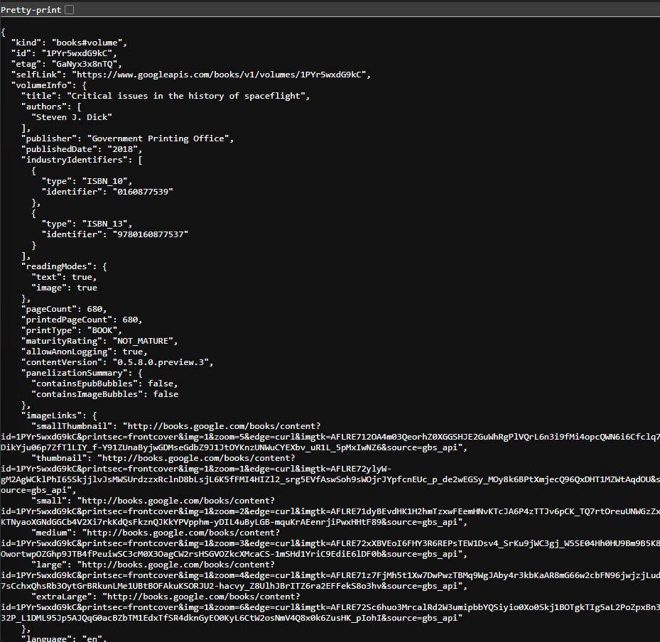

# Praktikum Pemrograman Mobile

**Nama**  : Muhammad Rafi Rajendra  
**NIM**   : 2341720158  
**Kelas** : TI-3H

## Praktikum 1: Mengunduh Data dari Web Service (API)

### Soal 1: Tambahkan nama panggilan Anda pada title app sebagai identitas hasil pekerjaan Anda.

```dart
import 'dart:async';
import 'package:flutter/material.dart';
import 'package:http/http.dart';
import 'package:http/http.dart' as http;

void main() {
  runApp(const MyApp());
}

class MyApp extends StatelessWidget {
  const MyApp({super.key});

  @override
  Widget build(BuildContext context) {
    return MaterialApp(
      title: 'Muhammad Rafi Rajendra',
      theme: ThemeData(
        primarySwatch: Colors.blue,
      ),
      home: const FuturePage(),
    );
  }
}

class FuturePage extends StatefulWidget {
  const FuturePage({super.key});

  @override
  State<FuturePage> createState() => _FuturePageState();
}

class _FuturePageState extends State<FuturePage> {
  String result = '';

  Future<Response> getData() async {
    const authority = 'www.googleapis.com';
    const path = '/books/v1/volumes/1PYr5wxdG9kC';
    Uri url = Uri.https(authority, path);
    return http.get(url);
  }

  @override
  Widget build(BuildContext context) {
    return Scaffold(
      appBar: AppBar(
        title: const Text('Back from the Future'),
      ),
      body: Center(
        child: Column(children: [
            const Spacer(),
            ElevatedButton(
              child: const Text('GO'),
              onPressed: (){},
            ),
            const Spacer(),
            Text(result),
            const Spacer(),
            const CircularProgressIndicator(),
            const Spacer(),
          ],
        ),
      ),
    );
  }
}
```

### Soal 2: 
- Carilah judul buku favorit Anda di Google Books, lalu ganti ID buku pada variabel path di kode tersebut. Caranya ambil di URL browser Anda seperti gambar berikut ini.

- Kemudian cobalah akses di browser URI tersebut dengan lengkap seperti ini. Jika menampilkan data JSON, maka Anda telah berhasil. Lakukan capture milik Anda dan tulis di README pada laporan praktikum. Lalu lakukan commit dengan pesan "W11: Soal 2".

```dart
    const authority = 'www.googleapis.com';
    const path = '/books/v1/volumes/1PYr5wxdG9kC';
```

Output Untuk Soal 2:



### Soal 3
- Jelaskan maksud kode langkah 5 tersebut terkait substring dan catchError!

1. substring(0, 450)

- Baris value.body.toString().substring(0, 450) mengambil 450 karakter pertama dari respons (mulai indeks 0 sampai <450).

- Masalahnya: kalau panjang string < 450, substring akan melempar RangeError → ini dianggap error di rantai Future dan akan masuk ke catchError.

2. 2) .catchError((_) { ... })

- catchError menangkap semua error yang terjadi pada getData() atau di dalam callback .then(...) (mis. RangeError dari substring).

- Capture hasil praktikum Anda berupa GIF dan lampirkan di README. Lalu lakukan commit dengan pesan "W11: Soal 3".


## Praktikum 2: Menggunakan await/async untuk menghindari callbacks

### Soal 4:

- Jelaskan maksud kode langkah 1 dan 2 tersebut!

  - Langkah 1 — Tiga fungsi async “dummy” yang mengembalikan angka
    - Sama untuk returnTwoAsync() dan returnThreeAsync() (masing-masing delay 3 detik lalu mengembalikan 2 dan 3).
    - Intinya: mensimulasikan pekerjaan asinkron (mis. call API, I/O) selama 3 detik, lalu mengembalikan nilai int.

  - Langkah 2 — Menjumlahkan hasilnya secara sekuensial lalu tampilkan ke UI
    - await membuat tiap pemanggilan menunggu selesai sebelum lanjut ke berikutnya, jadi total waktu ≈ 3 + 3 + 3 = 9 detik.
    - setState mengubah state widget agar UI menampilkan hasil penjumlahan ("6").

- Capture hasil praktikum Anda berupa GIF dan lampirkan di README. Lalu lakukan commit dengan pesan "W11: Soal 4".

Hasil Praktikum 2:


## Praktikum 3: Menggunakan Completer di Future

### Soal 5:
- Jelaskan maksud kode langkah 2 tersebut!
  - Completer dipakai untuk mengendalikan penyelesaian sebuah Future secara manual (kapan dan dengan nilai apa).
  - getNumber() memberi kamu Future<int>; calculate() memutuskan kapan future itu selesai (setelah delay 5 dtk) dan dengan nilai apa (42).

- Capture hasil praktikum Anda berupa GIF dan lampirkan di README. Lalu lakukan commit dengan pesan "W11: Soal 5".

Hasil Praktikum 3 pada Soal 5:


### Soal 6:
- Jelaskan maksud perbedaan kode langkah 2 dengan langkah 5-6 tersebut!

  - Langkah 2: calculate() tidak punya penanganan error. Jika sesuatu gagal sebelum complete(42) terpanggil, completer.future bisa menggantung (tidak pernah selesai dan tidak pernah error).
  - Langkah 5–6: calculate() dibungkus try/catch, sehingga future selalu berakhir:
    - sukses → complete(42)
    - gagal → completeError(...)
    Lalu pemanggilnya (getNumber().then(...).catchError(...)) menangani hasil dan error secara eksplisit di UI.

- Capture hasil praktikum Anda berupa GIF dan lampirkan di README. Lalu lakukan commit dengan pesan "W11: Soal 6".

Hasil Praktikum 3 Soal 6:


## Praktikum 4: Memanggil Future secara paralel

### Soal 7:
- Capture hasil praktikum Anda berupa GIF dan lampirkan di README. Lalu lakukan commit dengan pesan "W11: Soal 7".

Hasil Praktikum 4:


### Soal 8:
- Jelaskan maksud perbedaan kode langkah 1 dan 4!

  - FutureGroup: bisa add beberapa kali, lalu close() untuk “ngunci” supaya future-nya bisa resolve.
  - Future.wait: harus punya list lengkap saat pemanggilan.

  - FutureGroup wajib close(); tanpa ini, futureGroup.future tidak akan pernah selesai.
  - Future.wait tidak perlu close().

  - Future.wait menjamin urutan hasil sesuai urutan di list input, meski selesainya acak.
  - FutureGroup umumnya juga sesuai urutan penambahan (add order). (Tetap best-practice: jangan asumsi “finish order”.)

  - Future.wait: jika ada satu future error, future gabungan akan complete dengan error (tidak ada List hasil). Kalau butuh “tahan error per item”, tangani di masing-masing future: returnTwoAsync().catchError((_) => 0).

  - FutureGroup: perilaku mirip—kalau ada future error dan tidak kamu tangani per item, future gabungan akan error juga. Keuntungannya, kamu punya kontrol untuk menambah/menangani future sebelum close().

