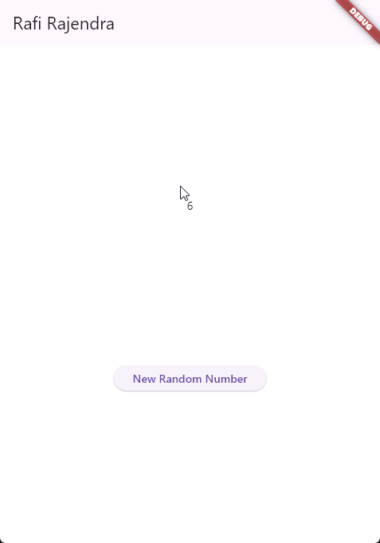
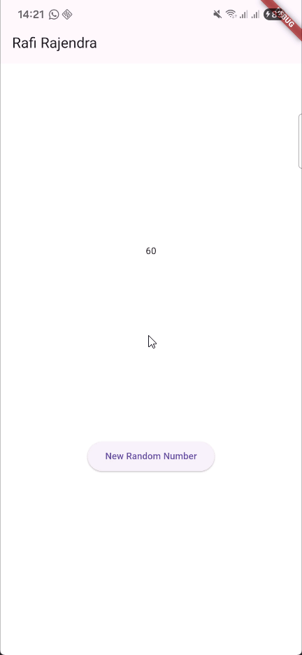

# Praktikum Pemrograman Mobile

**Nama**  : Muhammad Rafi Rajendra  
**NIM**   : 2341720158  
**Kelas** : TI-3H

## Praktikum 1: Dart Streams

### Soal 1
- Tambahkan nama panggilan Anda pada title app sebagai identitas hasil pekerjaan Anda.
- Gantilah warna tema aplikasi sesuai kesukaan Anda.
- Lakukan commit hasil jawaban Soal 1 dengan pesan "W12: Jawaban Soal 1"
```dart
import 'package:flutter/material.dart';

void main() {
  runApp(const MyApp());
}

class MyApp extends StatelessWidget {
  const MyApp({super.key});

  @override
  Widget build(BuildContext context) {
    return MaterialApp(
      title: 'Rafi Rajendra',
      theme: ThemeData(
        primarySwatch: Colors.cyan,
      ),
      home: const StreamHomePage(),
    );
  }
}

class StreamHomePage extends StatefulWidget {
  const StreamHomePage({super.key});

  @override
  State<StreamHomePage> createState() => _StreamHomePageState();
}

class _StreamHomePageState extends State<StreamHomePage> {
  @override
  Widget build(BuildContext context) {
    return Container();
  }
}
```

### Soal 2
- Tambahkan 5 warna lainnya sesuai keinginan Anda pada variabel colors tersebut.
- Lakukan commit hasil jawaban Soal 2 dengan pesan "W12: Jawaban Soal 2"
```dart
class ColorStream {
  final List<Color> colors = [
    Colors.pink,
    Colors.deepOrange,
    Colors.yellowAccent,
    Colors.lightGreenAccent,
    Colors.lightBlueAccent,
    Colors.deepPurple,
  ];
}
```

### Soal 3
- Jelaskan fungsi keyword yield* pada kode tersebut!
    - Fungsi Keyword yield* digunakan dalam fungsi generator (async*) untuk mendelegasikan aliran nilai dari stream lain ke stream utama
- Apa maksud isi perintah kode tersebut?
    - Fungsi getColors() akan menghasilkan warna baru dari daftar setiap detik, dan akan terus berulang tanpa henti
- Lakukan commit hasil jawaban Soal 3 dengan pesan "W12: Jawaban Soal 3"

### Soal 4
- Capture hasil praktikum Anda berupa GIF dan lampirkan di README.
    - 
- Lakukan commit hasil jawaban Soal 4 dengan pesan "W12: Jawaban Soal 4"

### Soal 5
- Jelaskan perbedaan menggunakan listen dan await for (langkah 9) !
    - listen: Digunakan jika butuh fleksibilitas lebih tinggi dan kontrol terhadap stream
    - await for: - Digunakan jika ingin alur yang sederhana dan berurutan.
- Lakukan commit hasil jawaban Soal 5 dengan pesan "W12: Jawaban Soal 5"

## Praktikum 2: Stream controllers dan sinks

### Soal 6
- Jelaskan maksud kode langkah 8 dan 10 tersebut!
    - Kode langkah 8
        - Menginisialisasi stream angka
        - Mendengarkan data baru dari stream
        - Memperbarui tampilan UI setiap kali angka baru diterima
    - Kode langkah 10
        - Menggabungkan logika acak dengan stream
        - Memungkinkan UI bereaksi terhadap data baru secara asinkron dan real-time
- Capture hasil praktikum Anda berupa GIF dan lampirkan di README.
    - 
- Lalu lakukan commit dengan pesan "W12: Jawaban Soal 6".

### Soal 7
- Jelaskan maksud kode langkah 13 sampai 15 tersebut!
    ```dart
    addError(){
    controller.sink.addError('error cuy');
    }

    stream.listen((event){
    setState((){
        lastNumber = event;
    });
    }).onError((error){
    setState((){
        lastNumber = -1;
    });
    });

    void addRandomNumber() {
    Random random = Random();
    // int myNum = random.nextInt(10);
    // numberStream.addNumberToSink(myNum);
    numberStream.addError();
    }
    ```

    ---

    ### Penjelasan Per Baris

    #### 1. **Fungsi `addError()`**
    ```dart
    addError(){
    controller.sink.addError('error cuy');
    }
    ```
    - Fungsi ini menambahkan **error ke stream** menggunakan `addError`.
    - `'error cuy'` adalah pesan error yang dikirim.
    - `controller.sink` adalah jalur masuk ke stream, dan `addError()` akan memicu **handler error** pada listener stream.

    ---

    #### 2. **Listener Stream dengan Penanganan Error**
    ```dart
    stream.listen((event){
    setState((){
        lastNumber = event;
    });
    }).onError((error){
    setState((){
        lastNumber = -1;
    });
    });
    ```
    - `stream.listen(...)` akan menangkap setiap data (`event`) yang dikirim ke stream.
    - `setState()` digunakan untuk memperbarui nilai `lastNumber` dengan data terbaru.
    - Jika terjadi **error**, blok `onError(...)` akan dijalankan dan `lastNumber` diset ke `-1` sebagai penanda bahwa terjadi kesalahan.

    ---

    #### 3. **Fungsi `addRandomNumber()`**
    ```dart
    void addRandomNumber() {
    Random random = Random();
    // int myNum = random.nextInt(10);
    // numberStream.addNumberToSink(myNum);
    numberStream.addError();
    }
    ```
    - Fungsi ini awalnya dimaksudkan untuk menambahkan angka acak ke stream.
    - Namun, dua baris yang menghasilkan angka acak dan mengirimkannya ke stream **dikomentari**.
    - Sebagai gantinya, fungsi ini memanggil `numberStream.addError()`, yang kemungkinan besar adalah metode yang memanggil `addError()` seperti di atas.

    ---

    ### 🎯 Tujuan Kode

    - **Simulasi error dalam stream**: Dengan memanggil `addError()`, kamu bisa menguji bagaimana aplikasi menangani error dari stream.
    - **Respons UI terhadap error**: Saat error terjadi, UI akan menampilkan `-1` sebagai indikator bahwa ada masalah.
    - **Latihan pemahaman stream dan error handling**: Ini sangat berguna untuk memahami bagaimana stream bekerja dalam Flutter, terutama dalam konteks real-time data dan error management.

    ---

## Praktikum 3: Injeksi data ke streams

### Soal 8
- Jelaskan maksud kode langkah 1-3 tersebut!
  - Langkah 1: Siapkan variabel transformer untuk mengolah stream int.
  - Langkah 2: Definisikan bagaimana data & error di stream diolah:
    - data → dikali 10
    - error → diganti -1
    - done → stream ditutup.
  - Langkah 3: Mendengarkan stream yang sudah diproses oleh transformer, lalu menampilkan angka terakhir (lastNumber) di layar.
- Capture hasil praktikum Anda berupa GIF dan lampirkan di README.
  - Hasil Praktikum

  
- Lalu lakukan commit dengan pesan "W12: Jawaban Soal 8".

## Praktikum 4: Subscribe ke stream events

### Soal 9
Jelaskan maksud kode langkah 2, 6 dan 8 tersebut!
Capture hasil praktikum Anda berupa GIF dan lampirkan di README.
Lalu lakukan commit dengan pesan "W12: Jawaban Soal 9".