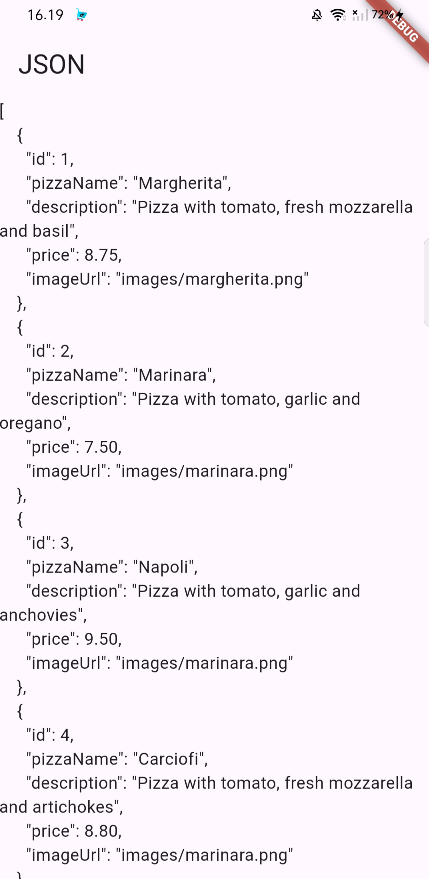
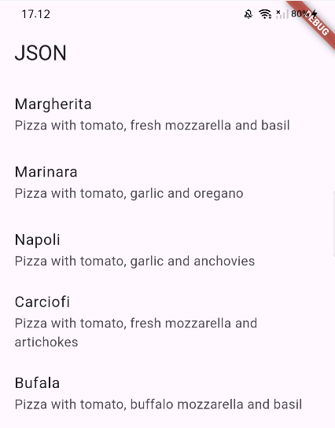
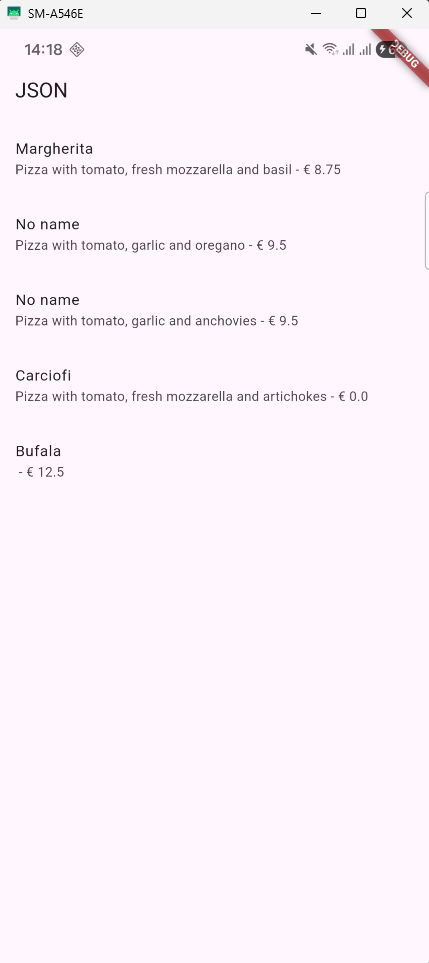

# Praktikum Pemrograman Mobile

**Nama**  : Muhammad Rafi Rajendra  
**NIM**   : 2341720158  
**Kelas** : TI-3H

# Praktikum 1: Konversi Dart model ke JSON

## Soal 1
- Tambahkan nama panggilan Anda pada title app sebagai identitas hasil pekerjaan Anda.
    ```dart
    class MyApp extends StatelessWidget {
        const MyApp({super.key});

        // This widget is the root of your application.
        @override
        Widget build(BuildContext context) {
            return MaterialApp(
            title: 'Flutter JSON Demo Rafi',
            theme: ThemeData(
                primarySwatch: Colors.blue,
            ),
            home: const MyHomePage(),
            );
        }
    }
    ```
- Gantilah warna tema aplikasi sesuai kesukaan Anda.
- Lakukan commit hasil jawaban Soal 1 dengan pesan "W13: Jawaban Soal 1"

## Soal 2
- Masukkan hasil capture layar ke laporan praktikum Anda.
    - Hasil

    
- Lakukan commit hasil jawaban Soal 2 dengan pesan "W13: Jawaban Soal 2"

## Soal 3
- Masukkan hasil capture layar ke laporan praktikum Anda.
    - Hasil

    
- Lakukan commit hasil jawaban Soal 2 dengan pesan "W13: Jawaban Soal 3"

# Praktikum 2: Handle kompatibilitas data JSON
## Soal 4
- Capture hasil running aplikasi Anda, kemudian impor ke laporan praktikum Anda!
    - Hasil Praktikum

    
- Lalu lakukan commit dengan pesan "W13: Jawaban Soal 4".