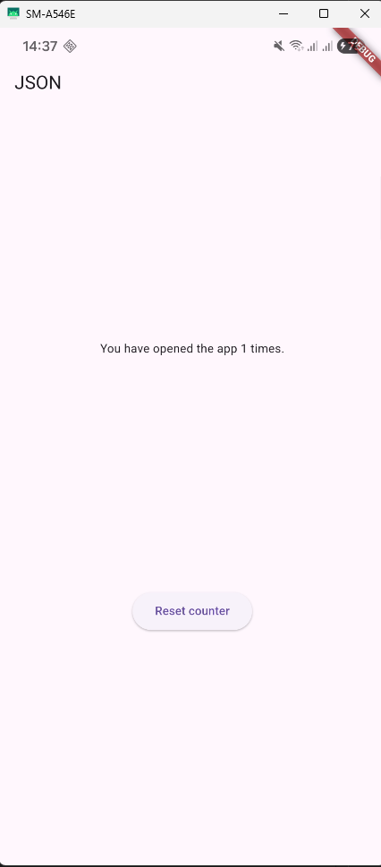
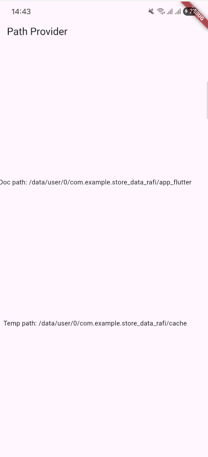
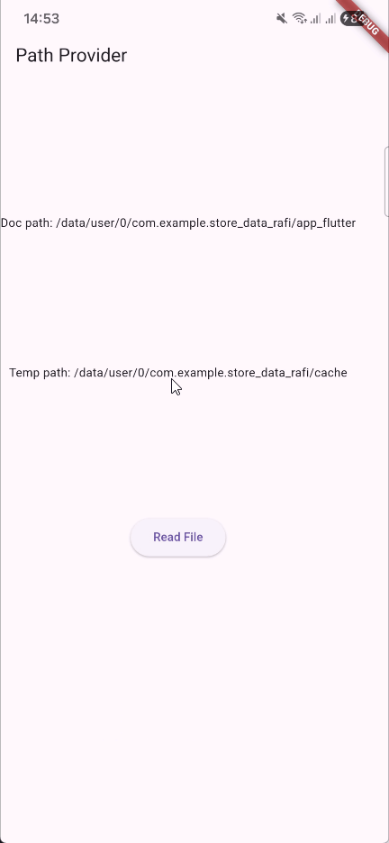

# Praktikum Pemrograman Mobile

**Nama**  : Muhammad Rafi Rajendra  
**NIM**   : 2341720158  
**Kelas** : TI-3H

# Praktikum 1: Konversi Dart model ke JSON

## Soal 1
- Tambahkan nama panggilan Anda pada title app sebagai identitas hasil pekerjaan Anda.
    ```dart
    class MyApp extends StatelessWidget {
        const MyApp({super.key});

        // This widget is the root of your application.
        @override
        Widget build(BuildContext context) {
            return MaterialApp(
            title: 'Flutter JSON Demo Rafi',
            theme: ThemeData(
                primarySwatch: Colors.blue,
            ),
            home: const MyHomePage(),
            );
        }
    }
    ```
- Gantilah warna tema aplikasi sesuai kesukaan Anda.
- Lakukan commit hasil jawaban Soal 1 dengan pesan "W13: Jawaban Soal 1"

## Soal 2
- Masukkan hasil capture layar ke laporan praktikum Anda.
    - Hasil

    
- Lakukan commit hasil jawaban Soal 2 dengan pesan "W13: Jawaban Soal 2"

## Soal 3
- Masukkan hasil capture layar ke laporan praktikum Anda.
    - Hasil

    
- Lakukan commit hasil jawaban Soal 2 dengan pesan "W13: Jawaban Soal 3"

# Praktikum 2: Handle kompatibilitas data JSON
## Soal 4
- Capture hasil running aplikasi Anda, kemudian impor ke laporan praktikum Anda!
    - Hasil Praktikum

    
- Lalu lakukan commit dengan pesan "W13: Jawaban Soal 4".

# Praktikum 3: Menangani error JSON
## Soal 5
- Jelaskan maksud kode lebih safe dan maintainable!
    - Penjelasan dari kode lebih **safe** dan **maintainable**
    ## 1. **SAFE (Lebih Aman)** 🛡️

    ### Tanpa Konstanta (Rawan Error):
    ```dart
    Pizza.fromJson(Map<String, dynamic> json)
        : id = json['id'],
        pizzaName = json['pizzaName'],
        price = json['pirce'];  // ❌ TYPO! 'pirce' bukan 'price'
        
    Map<String, dynamic> toJson() => {
    'id': id,
    'pizzaNme': pizzaName,  // ❌ TYPO! 'pizzaNme' bukan 'pizzaName'
    'price': price,
    };
    ```

    **Masalah:** Compiler **tidak akan mendeteksi** kesalahan pengetikan ini! Aplikasi berjalan, tapi:
    - Data tidak ter-parse dengan benar
    - Nilai jadi `null` atau default
    - Error baru ketahuan saat runtime (aplikasi crash atau data salah)
    - Sulit di-debug karena tidak ada error message yang jelas

    ### Dengan Konstanta (Aman):
    ```dart
    const String keyPrice = 'price';

    Pizza.fromJson(Map<String, dynamic> json)
        : price = json[keyPirce];  // ❌ Compiler ERROR! 'keyPirce' tidak ada
    ```

    **Keuntungan:** Compiler **langsung mendeteksi** error sebelum aplikasi dijalankan!
    - IDE akan memberikan red underline
    - Tidak bisa di-compile sampai diperbaiki
    - Error ketahuan saat development, bukan production

    ---

    ## 2. **MAINTAINABLE (Mudah Dirawat)** 🔧

    ### Skenario: API Backend berubah dari `pizzaName` menjadi `name`

    ### Tanpa Konstanta (Sulit):
    ```dart
    // Harus ubah di BANYAK tempat:
    Pizza.fromJson(Map<String, dynamic> json)
        : pizzaName = json['pizzaName'],  // ❌ Ubah di sini
        
    Map<String, dynamic> toJson() => {
    'pizzaName': pizzaName,  // ❌ Ubah di sini juga
    };

    // Kalau ada di fungsi lain:
    void updatePizza() {
    var name = json['pizzaName'];  // ❌ Dan di sini
    }

    void validate() {
    if (json.containsKey('pizzaName')) {  // ❌ Dan di sini
        // ...
    }
    }
    ```

    **Masalah:**
    - Harus cari dan ganti manual di semua file
    - Rawan terlewat satu tempat → bug!
    - Tidak ada jaminan semua sudah diganti

    ### Dengan Konstanta (Mudah):
    ```dart
    // Cukup ubah di SATU tempat:
    const String keyName = 'name';  // ✅ Ubah hanya di sini!

    // Semua yang pakai konstanta ini otomatis berubah:
    Pizza.fromJson(Map<String, dynamic> json)
        : pizzaName = json[keyName],  // ✅ Otomatis pakai 'name'
        
    Map<String, dynamic> toJson() => {
    keyName: pizzaName,  // ✅ Otomatis pakai 'name'
    };
    ```

    **Keuntungan:**
    - **Single Source of Truth**: Satu tempat untuk satu nilai
    - Refactoring cepat dan aman
    - IDE bisa "Find All References" untuk tracking penggunaan

    ---

    ## 3. **Contoh Real World** 🌍

    Bayangkan Anda punya 10 file yang menggunakan kunci JSON yang sama:

    ```
    lib/
    ├── model/pizza.dart
    ├── services/pizza_service.dart
    ├── controllers/pizza_controller.dart
    ├── utils/pizza_validator.dart
    ├── widgets/pizza_card.dart
    └── ... 10 file lainnya
    ```

    **Tanpa Konstanta:**
    - Harus buka 10 file
    - Cari manual setiap 'pizzaName'
    - Ganti satu per satu
    - Risiko terlewat: **TINGGI** ⚠️

    **Dengan Konstanta:**
    - Ubah 1 konstanta
    - Semua file otomatis konsisten
    - Risiko terlewat: **NOL** ✅

    ---

    ## 4. **Autocomplete & IntelliSense** 💡

    Ketika mengetik:
    ```dart
    json[key...]  // IDE akan suggest: keyId, keyName, keyDescription, dll
    ```

    Tanpa konstanta, Anda harus ingat sendiri string yang benar.

    ---

    ## Kesimpulan:

    | Aspek | Tanpa Konstanta | Dengan Konstanta |
    |-------|----------------|------------------|
    | **Deteksi Typo** | Runtime (terlambat) | Compile-time (cepat) |
    | **Perubahan API** | Manual di banyak tempat | Satu tempat saja |
    | **Risiko Bug** | Tinggi | Rendah |
    | **Development Time** | Lama (debugging) | Cepat (error langsung) |
    | **Code Review** | Sulit spot typo | Mudah & konsisten |

    **SAFE** = Compiler melindungi Anda dari kesalahan manusia
    **MAINTAINABLE** = Perubahan mudah, cepat, dan aman
- Capture hasil praktikum Anda dan lampirkan di README.
    - Hasil

    
- Lalu lakukan commit dengan pesan "W13: Jawaban Soal 5".

# Praktikum 4: SharedPreferences
## Soal 6
- Capture hasil praktikum Anda berupa GIF dan lampirkan di README.
    - Hasil Praktikum 4:

    

    
- Lalu lakukan commit dengan pesan "W13: Jawaban Soal 6".

# Praktikum 5: Akses filesystem dengan path_provider
## Soal 7
- Capture hasil praktikum Anda dan lampirkan di README.
    - Hasil Praktikum

    
- Lalu lakukan commit dengan pesan "W13: Jawaban Soal 7".

# Praktikum 6: Akses filesystem dengan direktori
## Soal 8
- Jelaskan maksud kode pada langkah 3 dan 7 !
    ## Penjelasan Langkah 3 dan Langkah 7
    ### **Langkah 3: Method writeFile()**

    ```dart
    Future<bool> writeFile() async {
    try {
        await myFile.writeAsString('Margherita, Capricciosa, Napoli');
        return true;
    } catch (e) {
        return false;
    }
    }
    ```

    **Penjelasan detail:**

    1. **`Future<bool>`** - Method ini mengembalikan `Future` dengan tipe `bool` (true/false)
    - Karena operasi file bersifat asinkron (membutuhkan waktu)
    - Return `bool` untuk menandakan sukses (true) atau gagal (false)

    2. **`async`** - Menandakan method ini asinkron
    - Memungkinkan penggunaan keyword `await`
    - Tidak memblokir thread utama saat menulis file

    3. **`try-catch` block** - Error handling
    - **`try`**: Mencoba menulis file
    - **`catch`**: Menangkap error jika terjadi masalah (misal: permission denied, disk penuh, dll)

    4. **`await myFile.writeAsString('...')`**
    - **`myFile`**: Object File yang sudah diinisialisasi dengan path `$documentsPath/pizzas.txt`
    - **`writeAsString()`**: Method untuk menulis string ke file
    - **`await`**: Menunggu operasi penulisan selesai sebelum lanjut ke baris berikutnya
    - Jika file belum ada → otomatis dibuat
    - Jika file sudah ada → konten lama ditimpa (overwrite)

    5. **Return value:**
    - `return true` → File berhasil ditulis
    - `return false` → Terjadi error saat menulis

    **Kapan dipanggil?** Di `initState()` setelah path didapat:
    ```dart
    getPaths().then((_) {
    myFile = File('$documentsPath/pizzas.txt');
    writeFile(); // ← Dipanggil otomatis saat app pertama kali dibuka
    });
    ```

    ---

    ### **Langkah 7: Run (Cara Kerja Aplikasi)**

    **Flow aplikasi:**

    1. **Saat aplikasi pertama kali dibuka:**
    ```
    initState() dipanggil
    → getPaths() dijalankan untuk mendapat path directory
    → myFile diinisialisasi: File('$documentsPath/pizzas.txt')
    → writeFile() otomatis dipanggil
    → File 'pizzas.txt' dibuat dan diisi dengan 'Margherita, Capricciosa, Napoli'
    ```

    2. **User melihat UI:**
    - Doc path ditampilkan (misalnya: `/data/user/0/com.example.app/documents`)
    - Temp path ditampilkan (misalnya: `/data/user/0/com.example.app/cache`)
    - Tombol "Read File"
    - Area kosong untuk teks (karena `fileText` masih kosong string `''`)

    3. **User menekan tombol "Read File":**
    ```
    onPressed: () => readFile() dipanggil
    → myFile.readAsString() membaca isi file 'pizzas.txt'
    → setState() dipanggil untuk update UI
    → fileText = 'Margherita, Capricciosa, Napoli'
    → Text(fileText) di UI menampilkan konten file
    ```

    **Hasil yang terlihat:**
    ```
    Doc path: /data/user/0/com.example.shared/documents
    Temp path: /data/user/0/com.example.shared/cache
    [Tombol Read File]
    Margherita, Capricciosa, Napoli  ← Muncul setelah tombol ditekan
    ```

    ---

    ## **Konsep Penting:**

    | Aspek | Penjelasan |
    |-------|------------|
    | **Persistent Storage** | File tetap ada meskipun app ditutup/restart |
    | **Async Operations** | Operasi file tidak memblokir UI (app tetap responsive) |
    | **Error Handling** | Try-catch mencegah crash jika ada masalah |
    | **Separation of Concerns** | Write (langkah 3) terpisah dari Read (langkah 5) |
    | **User Interaction** | User kontrol kapan membaca file (via tombol) |

    **Analogi sederhana:**
    - **writeFile()** = Menulis surat dan menyimpan di laci
    - **readFile()** = Membuka laci dan membaca surat yang sudah ditulis
    - File di documents directory = Laci yang isinya tidak hilang meski rumah ditutup

- Capture hasil praktikum Anda berupa GIF dan lampirkan di README.
    - Hasil Praktikum
    
    
- Lalu lakukan commit dengan pesan "W13: Jawaban Soal 8".

# Praktikum 7: Menyimpan data dengan enkripsi/dekripsi
## Soal 9
- Capture hasil praktikum Anda berupa GIF dan lampirkan di README.
    - Hasil Praktikum

    
- Lalu lakukan commit dengan pesan "W13: Jawaban Soal 9".