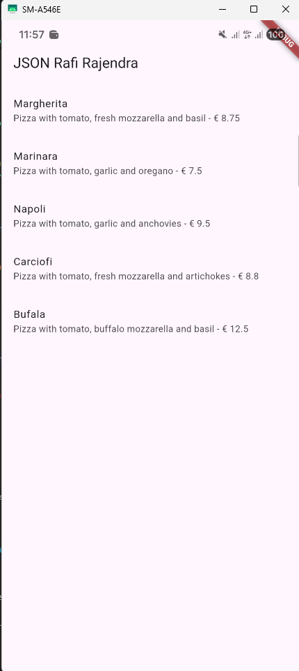
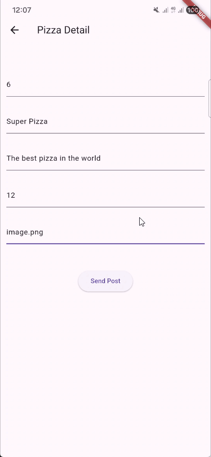
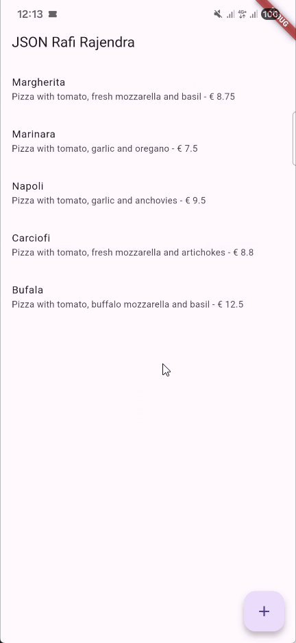

# Praktikum Pemrograman Mobile

**Nama**  : Muhammad Rafi Rajendra  
**NIM**   : 2341720158  
**Kelas** : TI-3H

# Praktikum 1: Membuat layanan Mock API

## Soal 1
- Tambahkan nama panggilan Anda pada title app sebagai identitas hasil pekerjaan Anda.
- Gantilah warna tema aplikasi sesuai kesukaan Anda.
- Capture hasil aplikasi Anda, lalu masukkan ke laporan di README dan lakukan commit hasil jawaban Soal 1 dengan pesan "W14: Jawaban Soal 1"
    - Hasil Praktikum

    

# Praktikum 2: Mengirim Data ke Web Service (POST)

## Soal 2
- Tambahkan field baru dalam JSON maupun POST ke Wiremock!
- Capture hasil aplikasi Anda berupa GIF di README dan lakukan commit hasil jawaban Soal 2 dengan pesan "W14: Jawaban Soal 2"
    - Hasil Praktikum

    

# Praktikum 3: Memperbarui Data di Web Service (PUT)

## Soal 3
- Ubah salah satu data dengan Nama dan NIM Anda, lalu perhatikan hasilnya di Wiremock.
- Capture hasil aplikasi Anda berupa GIF di README dan lakukan commit hasil jawaban Soal 3 dengan pesan "W14: Jawaban Soal 3"
    - Hasil Praktikum

    
